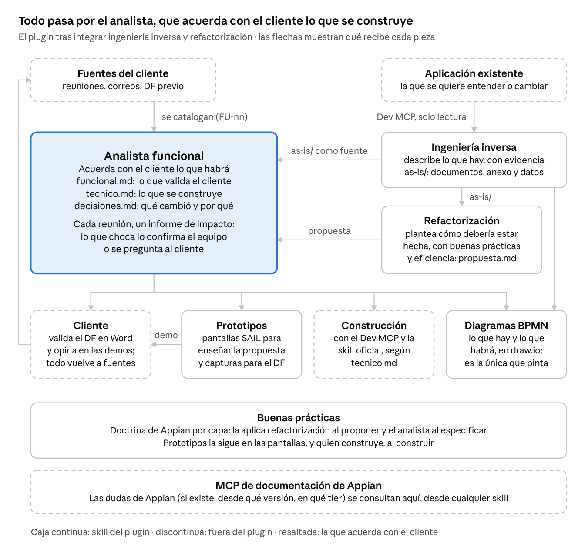

# Plan: integrar la ingeniería inversa en el plugin

> Copia del diseño aprobado por Raúl el 2026-10-07 en el doc «Plan: integrar la ingeniería inversa en el plugin»
> (Claude Docs). Si el doc cambia, se actualiza esta copia en el mismo commit que el cambio de plan.

Ingeniería inversa queda para una sola cosa: documentar con precisión y sin relleno cómo está hecha una aplicación que existe. El bloque B sale a una skill nueva, refactorización, que plantea una solución bien hecha para toda la aplicación o una parte. El analista mantiene los requisitos coherentes reunión a reunión y especifica lo que se construye, y el plugin dirá a cada compañero qué le falta al instalarlo.

La regla: ingeniería inversa describe lo que hay; refactorización propone cómo debería estar hecho; el analista acuerda con el cliente lo que habrá y prototipos se lo enseña; buenas prácticas pone la doctrina y diagramas dibuja. Plan aprobado el 7 de octubre, con las decisiones al final. El repositorio ya está en GitHub (F1) y el plan de implementación detallado vive en él.

## Lo que entiendo que necesitas

Siete necesidades, cada una con la prueba que demostrará que se cumple.

| Necesidad | Cómo se demuestra |
|---|---|
| Documentar una aplicación antigua o mal hecha para que el equipo entienda cómo está hecha, con precisión y sin palabrería | Un agente que solo lee `as-is/` responde 22 preguntas típicas del equipo sobre una aplicación ficticia: al menos 20 bien, entre ellas qué quedó sin verificar y qué hace falta, cada una con su evidencia, y ningún objeto inventado. Con menos texto que hoy |
| El bloque B, aparte de ingeniería inversa, y sin la skill suelta | Ingeniería inversa no genera nada del bloque B, y la skill suelta se desinstala al cerrar (F9) |
| Plantear una solución nueva bien hecha, para toda la aplicación o una parte, con buenas prácticas y eficiencia | En una aplicación ficticia con 11 malas prácticas sembradas, refactorización encuentra al menos 10 y propone para cada una una alternativa con su regla de buenas prácticas |
| Entender una aplicación para rehacer una parte o añadirle funcionalidades | En esa aplicación, un evolutivo con tres historias nuevas: el técnico marca bien qué es nuevo, qué se modifica y qué existe, con los nombres reales (lo comprueba un script) |
| Analista: partir de un DF ya hecho y sus reuniones, digerir las reuniones periódicas y detectar incoherencias que confirma el equipo, o el cliente si nadie sabe responder | Proyecto ficticio con DF y tres reuniones con 10 incoherencias sembradas: el informe de impacto encuentra las 10 y no aplica ninguna sin confirmación |
| Enseñar la propuesta al cliente con el prototipo y ajustar con su feedback | Demo ficticia con 6 comentarios: cambian solo las pantallas afectadas, y las validadas no se tocan sin permiso |
| Que lo use cualquiera del equipo, sin depender de tu PC, y que se le avise de lo que falta | En un equipo limpio, el plugin dice exactamente qué falta y cómo instalarlo; con todo instalado pasan todas las pruebas, y el paquete no tiene rutas ni datos personales |

**Lo que supongo** (corrígeme si no es así):

- Ingeniería inversa se podrá usar sola, sin abrir un análisis.
- La skill suelta se quita cuando la versión del plugin pase las pruebas, no antes.
- La documentación de ingeniería inversa y la propuesta de refactorización son para el equipo; al cliente le llega el DF.
- Cada compañero configura su propio Dev MCP con sus credenciales; el plugin no lleva ninguna.

## Después de ingeniería inversa: tres caminos

Refactorización plantea la solución y el analista la valida con el cliente y la especifica (D1). Así los requisitos y la especificación técnica siguen teniendo un solo dueño, y quien construye recibe siempre el mismo documento.

| Qué se quiere | Camino | Qué valida el cliente | Qué recibe quien construye |
|---|---|---|---|
| Entender la aplicación | Ingeniería inversa | Nada: es para el equipo | — |
| Añadir funcionalidades a lo que hay | Ingeniería inversa → analista → prototipos | El DF con las historias nuevas y las pantallas que cambian | El técnico, con cada objeto Nuevo, Modifica o Existe y su nombre real |
| Rehacer una parte o toda la aplicación, bien hecha | Ingeniería inversa → refactorización → analista → prototipos | El DF: lo que se conserva, lo que cambia y las pantallas nuevas | El técnico, que baja a objetos la propuesta, con «Sustituye a» y la migración de datos |

Si un evolutivo toca una parte con hallazgos graves, el analista lo avisa y esa parte puede pasar antes por refactorización. Rehacer una parte y añadir funcionalidades a la vez es el tercer camino con historias nuevas en el DF.

**La línea entre las dos skills.** La propuesta de refactorización llega hasta entidades, procesos y patrones de pantalla («4 record types sincronizados en lugar de 9 CDT», «un proceso con 3 subprocesos en lugar de uno de 140 nodos»). Los campos, los nodos y las interfaces los detalla el técnico, que cita cada decisión de la propuesta.

**Descartado:** que refactorización hiciera también los requisitos y el diseño detallado. En cuanto el cliente pidiera un cambio o hubiera funcionalidades nuevas, el proyecto tendría dos especificaciones de requisitos y dos técnicas.

Cada pieza de hoy queda así:

| Pieza de hoy | Queda en | Por qué |
|---|---|---|
| 00–11, INVENTARIO, anexo y LEEME; extractor de solo lectura; los cinco agentes de análisis; registro de hallazgos; detección de secretos; publicadores de PDF y panel | Ingeniería inversa | Describen lo que hay |
| 13 (diagnóstico, estrategia y plan), rebuild-architect y `modernization-guide.md` | Refactorización | Juzgan y proponen |
| 14: arquitectura objetivo, migración y convivencia | Refactorización | Son la solución propuesta |
| 14: datos, procesos, pantallas y catálogo objeto a objeto | Analista, en el técnico; target-designer se retira | La especificación detallada tiene un solo formato |
| 12 (RF, RN, RNF y PQ, con su etiqueta: equivalente, corrección u objetivo) | Analista: cada historia dice su origen | Los requisitos se validan en el DF |
| `bpmn_layout.py`, `validate_mermaid.py` y `render_diagrams.sh` (mmdc) | Se retiran: dibuja y exporta la skill de diagramas | Un solo exportador BPMN y un solo pintor |
| `docs-mcp-usage.md` y las reglas de prosa de `presentation-rules.md` | La regla común «Dudas de Appian» y `redaccion.md` | Cada regla en un sitio |
| `docs/` (especificación, changelog y primera ejecución) | El repositorio, fuera del paquete | Son de desarrollo |

## Quién hace qué

Seis skills, cada una con una sola responsabilidad. Su descripción dice lo que no hace y a quién remite.

| Skill | Se ocupa de | No hace |
|---|---|---|
| Ingeniería inversa | Documentar cómo está hecha una aplicación que existe, con evidencia de cada dato | Juzgar, recomendar, escribir requisitos o diseñar |
| Refactorización (nueva) | Plantear una solución bien hecha para toda la aplicación o una parte: diagnóstico, arquitectura y decisiones con buenas prácticas y eficiencia, migración y hoja de ruta | Requisitos, la especificación objeto a objeto, construir |
| Analista funcional | Requisitos coherentes reunión a reunión: el funcional que valida el cliente, el técnico que se construye y las decisiones | Leer el entorno, dibujar, componer pantallas |
| Prototipos | Enseñar la propuesta al cliente con pantallas SAIL navegables, con su marca si el proyecto la tiene, y sacar capturas para el DF | Decidir qué hace una pantalla |
| Diagramas BPMN | Dibujar en draw.io los procesos de lo que hay y de lo que habrá, y exportarlos; es la única que pinta | Decidir los pasos de un proceso |
| Buenas prácticas | La doctrina de Appian y la revisión de un objeto o un cambio | Evaluar una aplicación entera, analizar, dibujar |

Todas consultan el MCP de documentación cuando no saben algo de Appian con certeza.

## Ingeniería inversa: precisa y sin relleno

Cada dato lleva su evidencia y cada documento responde a preguntas del equipo; lo que no responde a ninguna, sobra.

- **Preguntas primero.** Cada documento empieza por las preguntas que responde («¿qué proceso cambia este estado?», «¿quién puede aprobar?», «¿qué falla si cae esta integración?») y solo lleva lo que las responde.
- **Sin relleno.** Sigue las reglas de prosa del plugin (`redaccion.md`): no explica qué es un record type, no repite datos de otro documento (los enlaza) y las secciones vacías no salen. Tablas antes que prosa.
- **Hechos, no consejos.** Los hallazgos dicen qué pasa y qué riesgo tiene. Qué hacer lo dice refactorización.
- **Lo que falta, a la vista.** Lo que no se pudo verificar se registra (NV) con lo que hace falta para resolverlo (acceso, export, permiso, entorno o negocio) y a quién pedírselo. Nada se da por inexistente sin decir dónde se buscó, y lo que dice la definición no se toma por lo que pasa en ejecución.
- **Preguntas de la revisión.** Lo que el equipo quiere saber se apunta al empezar, y al terminar cada pregunta queda respondida, parcial o sin resolver, con su NV o con lo que la revisión no incluye.
- **Precisión comprobada.** `comprobar_asis.py` da error si:
  - un objeto citado no está en el INVENTARIO (nada inventado);
  - se cita un NV que no existe o queda una pregunta de la revisión sin cerrar;
  - una fila de hechos no lleva su evidencia enlazada al anexo y su certeza;
  - una cifra no sale de `summary.json`;
  - quedan marcadores de plantilla, enlaces rotos o secretos.
- **Avisos de estilo:** muletillas, frases largas, párrafos repetidos entre documentos y documentos que crecen más que lo que describen.
- **Datos para las demás skills** en `as-is/datos/`: inventario, dependencias, hallazgos, procesos y lo que queda sin verificar, en JSON, sin usuarios ni credenciales. Refactorización y el analista no tocan los datos en bruto.
- **Prueba del recién llegado** (primera tabla), antes y después del recorte, con una aplicación ficticia mal hecha a propósito y más completa que la del simulador actual. Esa misma aplicación sirve para las pruebas de refactorización y del analista.
- **Menos documentos si la prueba lo pide.** Si dos documentos responden a lo mismo, se unen. Candidatos: LEEME con 00, y 05 con 06.

## Refactorización: la skill nueva

Se usa después de ingeniería inversa, cuando se quiere plantear cómo debería estar hecha la aplicación, entera o una parte.

- **Entrada:** `as-is/` (documentos, anexo y datos), el alcance (la aplicación o qué módulos y procesos) y los límites del equipo (plazo, lo que no se puede tocar). No vuelve a leer el entorno.
- **Salida:** un solo documento, `refactorizacion/propuesta.md`:
  - **Alcance.** Qué se rehace y qué se queda como está.
  - **Diagnóstico.** Cada problema (REF-nn) con su evidencia en `as-is/`, la regla de buenas prácticas que incumple («BP nn §x») y su efecto en rendimiento, mantenimiento o riesgo.
  - **Solución.** Por capa (datos, seguridad, procesos, pantallas, integraciones): qué se hace, por qué y qué se descarta, hasta entidades, procesos y patrones de pantalla.
  - **Migración y convivencia.** Cómo pasan los datos y cómo conviven lo viejo y lo nuevo mientras dura el cambio.
  - **Hoja de ruta.** Fases en orden de dependencias.
  - **Pendientes.** Lo que tiene que decidir el equipo o el cliente, y lo que ingeniería inversa dejó sin verificar y condiciona la solución.
- **Piezas:** rebuild-architect sin el 12, la parte de arquitectura y migración del 14 y `modernization-guide.md` reducido a señales que remiten a buenas prácticas (la doctrina no se copia).
- **Después:** el analista escribe el funcional (lo que se conserva y lo que cambia) y el técnico, que baja a objetos cada decisión citando su REF.
- **No hace:** requisitos ni especificación objeto a objeto (analista), documentar la aplicación (ingeniería inversa) ni revisar un objeto suelto (buenas prácticas).

## Analista: requisitos coherentes reunión a reunión

La base ya existe. Cada fuente nueva produce un informe de impacto que clasifica cada punto (nuevo, completa, cambia, anula, pregunta…), y lo que choca con lo acordado espera a que el equipo decida: aplicar, dejar pendiente, descartar o preguntar al cliente. Nada validado por el cliente cambia sin ese visto bueno. Se añade:

1. **Un DF ya hecho como punto de partida.** El DF entra como versión 1.0 en el formato del plugin, con sus IDs originales en la trazabilidad (D2). De ahí salen el Word y el técnico, que es lo que se construye por MCP. Las reuniones anteriores al DF solo sirven para encontrar lo que el DF no recoge o contradice, y salen como puntos a confirmar. Las posteriores siguen el flujo normal.
2. **Guion de la próxima reunión.** `indice.py pendientes` lista las preguntas abiertas ordenadas por lo que bloquean, listas para llevar al cliente. Sus respuestas vuelven como fuente.
3. **Texto que queda viejo.** Hoy se busca a mano. `comprobar.py` avisará si lo que decía una pieza antes de un cambio sigue escrito en el funcional o en el técnico.
4. **Ciclo con el prototipo.** El feedback de cada demo se cataloga como fuente. El informe lo reparte por pantalla, y prototipos rehace solo las afectadas sin tocar las validadas.
5. **Aplicación existente.** Con `as-is/`, cada historia dice su origen: se conserva, cambia o es nueva. Si corrige un hallazgo, se cita en la trazabilidad y no en el DF. El técnico marca cada objeto como Nuevo, Modifica, Existe o «Sustituye a», y `comprobar.py` verifica esos nombres contra el INVENTARIO. Si hay refactorización, el técnico baja a objetos cada decisión citando su REF y suma un apartado de migración de datos.
6. **Aviso de parte mal hecha.** Si un evolutivo toca objetos con hallazgos graves, el analista lo dice y propone pasar esa parte por refactorización antes de construir encima.

**Pruebas:** las de incoherencias sembradas, la demo y el evolutivo de la primera tabla.

## Contrato de ficheros

Una carpeta por aplicación o proyecto: cada skill escribe solo en lo suyo y lee lo de las demás. Todo lo que el plugin genera al trabajar queda en esa carpeta; el repositorio del plugin solo tiene su código y sus pruebas. Ninguna skill lleva un proyecto, tampoco de ejemplo, ni la marca de un cliente: las pruebas y sus datos ficticios están en `pruebas/` y no van en el paquete, y la marca del cliente va en `prototipo/` de su proyecto.

```text
<p>/proyecto.md, fuentes/, notas/, impacto/   analista
<p>/as-is/                                     ingeniería inversa (documentos, anexo, datos/ y extraccion/)
<p>/refactorizacion/                           refactorización
<p>/analisis/                                  analista (los .drawio, .png y .bpmn de diagramas/, la skill de diagramas)
<p>/prototipo/                                 prototipos
<p>/entregables/, versiones/                   analista
```

La extracción completa también queda en el proyecto, en `as-is/extraccion/` (D4), y se escribe ya saneada: sin credenciales, secretos ni nombres de usuario, y con rutas cortas para Windows. Las demás skills leen `as-is/datos/`, que tiene formato fijo; la extracción es interna de ingeniería inversa.

| Quién lee | Qué | Para qué |
|---|---|---|
| Refactorización | `as-is/` | Diagnóstico, solución y pendientes |
| Analista | `as-is/`, catalogado como fuente | El origen de cada historia, los nombres reales del INVENTARIO y lo que está sin verificar: pregunta técnica o, si lo resuelve negocio, también pregunta al cliente |
| Analista | `refactorizacion/propuesta.md` | Las decisiones que el técnico baja a objetos |
| Diagramas | Los JSON de `as-is/08-procesos-bpmn/` y de `analisis/diagramas/` | Dibujar lo que hay y lo que habrá |
| Prototipos | `analisis/funcional.md` (y el técnico) | Las pantallas de la propuesta |

Dos reglas: los IDs de otra skill se citan dentro de su fuente («[FU-07 PAN-003]») y nunca se mezclan con los del análisis; y una decisión de la propuesta se cita en el técnico (DT-04 → REF-02), no se reescribe.

## Cualquiera del equipo puede usarlo

Nada puede depender de tu equipo. Lo que haga falta se comprueba y se le dice a quien lo usa, con cómo instalarlo y qué pierde si no lo hace.

| Requisito | Para qué | Si falta |
|---|---|---|
| Python 3.9 o superior | Todos los scripts | No funciona nada |
| Playwright y un navegador (Chromium, Chrome o Edge) | Imagen de los diagramas y capturas del prototipo | Diagramas sin imagen y prototipo sin capturas |
| Node.js con el paquete `docx` | DF en Word | Se entrega el `funcional.md` |
| LibreOffice | Revisar el Word como PDF | Se revisa a mano |
| `pdftotext` o `pypdf` | Leer PDF | Claude los lee directamente, más despacio |
| `uv` y el Dev MCP de Appian (26.5 o superior, rol Designer, con sus credenciales) | Ingeniería inversa | No se puede usar esa skill |
| Appian MCP Server del mismo entorno | Volúmenes y uso real | La documentación sale sin volúmenes |
| Skill de PDF de Claude | Exportar `as-is/` a PDF | Se entrega en Markdown |

El MCP de documentación va incluido en el plugin.

- **`requisitos.py`**, en la raíz del plugin, comprueba la tabla y dice, por skill, qué falta, el comando para instalarlo en Windows, macOS o Linux y qué se pierde. No instala nada sin permiso.
- **Aviso al instalar.** Un hook de inicio de sesión del plugin lo ejecuta y Claude se lo cuenta al usuario la primera vez. Si la app no admite hooks de plugin, el primer paso de cada skill es ese mismo comando. Lo compruebo en Claude Code y en la app de escritorio.
- **README** con la misma tabla, generada del mismo fichero para que no diverjan.
- **Nada personal ni de un proyecto en el paquete.** `comprobar_plugin.py` falla si encuentra rutas de tu equipo, tu correo o tu nombre fuera del autor, o una skill con pruebas, ejemplos, una carpeta con forma de proyecto o la marca de un cliente. Hoy la especificación de ingeniería inversa dice «en la carpeta local de Raul».
- **Instalación limpia.** El paquete se prueba en un equipo vacío: primero sin nada (el aviso tiene que ser exacto) y después con todo (todas las pruebas en verde).

## Cómo garantizamos que no se solapen

`comprobar_plugin.py` lo comprueba en cada cambio y falla si algo se rompe.

- **Un dueño por salida.** `pruebas/propietarios.json` asigna cada carpeta y tipo de fichero a una skill. Falla si un SKILL.md manda escribir en lo de otra.
- **Una pieza por capacidad.** Falla si aparece un exportador BPMN o un pintor fuera de diagramas, o reglas de prosa fuera de `redaccion.md`.
- **Reglas comunes idénticas.** El bloque «Dudas de Appian» es igual en todas las skills que lo llevan; ingeniería inversa y refactorización dejan de ser externas.
- **Prueba de enrutado.** `pruebas/enrutado.json` con unas 30 peticiones y la skill que debe atender cada una: «documenta la aplicación X» → ingeniería inversa; «¿cómo la rehacemos bien?» → refactorización; «incorpora la reunión de ayer» → analista. Se pasa con `claude plugin eval` si está disponible, o con un agente revisor.
- **Punta a punta.** Aplicación ficticia → `as-is/` → propuesta de refactorización → funcional → técnico → diagramas → prototipo. Después la revisa un agente que no ha visto el trabajo.

## Fases de trabajo

Diez fases en orden; ninguna se da por cerrada sin sus pruebas en verde.

- [x] **F0 Decisiones.** Tomadas el 7 de octubre.
- [x] **F1 Repositorio único.** El plugin, con ingeniería inversa dentro y su historial, en un solo repositorio del que parte cada hilo: raulogm077/Analista-Funcional-Appian, rama main.
- [ ] **F2 Ingeniería inversa en el plugin.** Antes, las skills se quedan solo con lo que usan al trabajar: sus pruebas y datos ficticios pasan a `pruebas/` y el caso de ejemplo de prototipos, un proyecto entero, sale del plugin; prototipos pasa a `appian-prototipos`, con el aspecto estándar de Appian por defecto, y saca la configuración de marca de cualquier cliente a partir de su nombre. Después, ingeniería inversa solo con el bloque A, sus pruebas en verde y su alta en `comprobar_plugin.py`. El bloque B se aparta para F5.
- [ ] **F3 Precisa y sin relleno.** `comprobar_asis.py`, las reglas de prosa comunes, `as-is/datos/`, la disciplina de evidencia (lo que queda sin verificar, negativos acotados, diseño frente a ejecución y preguntas de la revisión), la aplicación ficticia mal hecha a propósito y la prueba del recién llegado antes y después.
- [ ] **F4 Diagramas.** Un solo exportador BPMN y un solo pintor. Se retiran `bpmn_layout.py`, `validate_mermaid.py` y `render_diagrams.sh`.
- [ ] **F5 Refactorización.** La skill nueva con el 13, la arquitectura y la migración del 14, rebuild-architect y las señales. Lee solo `as-is/`. Prueba de malas prácticas sembradas.
- [ ] **F6 Analista.** DF ya hecho como base, guion de la próxima reunión, aviso de texto viejo, ciclo con el prototipo, aplicación existente y aviso de parte mal hecha. Pruebas de incoherencias sembradas, demo y evolutivo.
- [ ] **F7 Equipo.** `requisitos.py`, aviso al instalar, README y comprobación de que no hay nada personal.
- [ ] **F8 Sin solapes.** Las seis descripciones, `propietarios.json` y la prueba de enrutado.
- [ ] **F9 Cierre.** Punta a punta, revisión independiente, instalación limpia, versión 0.7.0-beta.1 y paquete. Después se desinstala la skill suelta de tu cuenta (y de quien la tenga) y se archiva su carpeta.

## Decisiones tomadas

Todas cerradas el 7 de octubre; el nombre del plugin se mantiene.

| Decisión | Elegido |
|---|---|
| Bloque B | Sale de ingeniería inversa a la skill `appian-refactorizacion`, y la skill suelta desaparece |
| **D1** Reparto | Refactorización propone y el analista especifica |
| **D2** DF ya hecho | Pasa al formato del plugin; de ahí salen el Word y el técnico con el que se construye por MCP |
| **D3** Repositorio | GitHub privado |
| **D4** Extracción | Dentro del proyecto, en `as-is/extraccion/`, ya saneada: sin credenciales, secretos ni nombres de usuario |
| Marca de los prototipos | El plugin se usará con varios clientes: por defecto, el aspecto estándar de Appian; la marca del cliente va en su proyecto y la skill pasa a llamarse `appian-prototipos`. Con decir para qué empresa se trabaja, la skill saca su configuración de marca completa, como la que había de AENA (objeto Site, perfil CSS, paleta, componentes, estados y gráficos), de su guía de marca o de su web, y la deja en el proyecto con una guía para construir con ella (añadido el 7 de octubre) |
| Datos de ejemplo de prototipos | Galerías y plantillas en un dominio ficticio neutro, sin aeropuertos ni códigos reales de un cliente (Tarea 25) |
| Disciplina de evidencia | Se adopta adaptada a lo que ya hace ingeniería inversa: registro de lo que queda sin verificar, negativos acotados, diseño frente a ejecución y preguntas de la revisión cerradas. Sin registro aparte de afirmaciones ni escala de confianza; la marca de inferido pasa a 🔶, la del analista |

## Cómo funciona el plugin



Todo lo que se construye pasa por el analista: ingeniería inversa le da los hechos, refactorización la propuesta, y diagramas y prototipos los dibujos y las pantallas. Lo que dice el cliente, en el DF o en las demos, vuelve como fuente.
