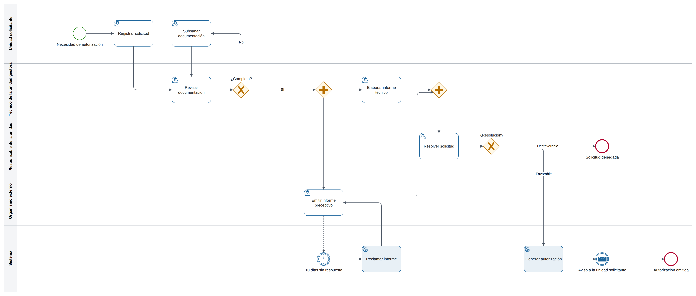
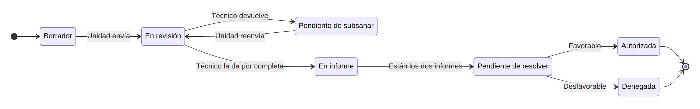

# Solicitudes de autorización — Diseño funcional

Versión: 1.1 · Estado: en validación

## 1. Objetivo y alcance

Hoy las unidades piden las autorizaciones por correo y la unidad gestora las sigue en una hoja de cálculo. Nadie sabe en qué punto está cada solicitud, y el informe del organismo externo se reclama por teléfono.

La aplicación sirve para registrar las solicitudes, revisar su documentación, pedir el informe del organismo, resolverlas y entregar la autorización. Cada unidad ve en todo momento en qué estado están las suyas.

Queda fuera de esta fase:
- La firma electrónica de la autorización. Se firma como hasta ahora y se valorará en la fase 2. <!-- ✅ FU-02 00:31:20 -->
- El alta en el registro general. La unidad sigue registrando la entrada en su sistema. <!-- ✅ FU-01 00:05:10 -->

Términos que se usan con un significado preciso:

| Término | Significa |
|---|---|
| Solicitud | La petición de una unidad para hacer algo que necesita autorización |
| Subsanar | Completar o corregir la documentación que el técnico ha pedido |
| Informe preceptivo | El informe del organismo externo, obligatorio antes de resolver |
| Resolución | La decisión final: favorable o desfavorable |

## 2. Perfiles

| Perfil | Quién es | Qué hace en la aplicación |
|---|---|---|
| Unidad solicitante | Personal de cualquier unidad que necesita una autorización | Registra y subsana solicitudes y consulta las de su unidad |
| Técnico de la unidad gestora | Técnicos de la unidad que tramita las autorizaciones | Revisa la documentación, pide el informe al organismo y redacta el informe técnico |
| Responsable de la unidad | Jefe de la unidad gestora | Resuelve las solicitudes |
| Consulta | Dirección y auditoría interna | Ve todas las solicitudes sin cambiar nada |

## 3. Proceso

### 3.1 Solicitud de autorización

**ACT-01 — Registrar solicitud** <!-- ✅ FU-01 00:04:10 -->

| Quién | Empieza cuando | Pantalla | Plazo |
|---|---|---|---|
| Unidad solicitante | La unidad necesita una autorización | PAN-03 | — |

Rellena los datos, adjunta la memoria y el plano, y envía la solicitud. Pasa a «En revisión» y los técnicos reciben la tarea de revisarla (AV-01).

**ACT-02 — Revisar documentación** <!-- ✅ FU-01 00:12:40 -->

| Quién | Empieza cuando | Pantalla | Plazo |
|---|---|---|---|
| Técnico de la unidad gestora | La unidad envía o subsana la solicitud | PAN-04 | 5 días hábiles |

Comprueba que están la memoria y el plano y que los datos coinciden con ellos.
- Si está completa, pide el informe al organismo y prepara el suyo (ACT-03 y ACT-04 a la vez).
- Si falta algo, la devuelve a la unidad con lo que falta (ACT-06).

**ACT-06 — Subsanar documentación** <!-- ✅ FU-01 00:15:30 -->

| Quién | Empieza cuando | Pantalla | Plazo |
|---|---|---|---|
| Unidad solicitante | El técnico devuelve la solicitud | PAN-03 | 10 días hábiles |

Corrige lo que el técnico ha indicado y vuelve a enviarla. Vuelve a ACT-02. Qué pasa si no la subsana en plazo está por decidir (pendiente: PC-02).

**ACT-03 — Elaborar informe técnico** <!-- ✅ FU-01 00:18:00 -->

| Quién | Empieza cuando | Pantalla | Plazo |
|---|---|---|---|
| Técnico de la unidad gestora | La solicitud está completa | PAN-02 | 10 días hábiles |

Redacta su valoración en la propia solicitud. Cuando están su informe y el del organismo, la solicitud pasa al responsable (ACT-05).

**ACT-04 — Emitir informe preceptivo** <!-- ✅ FU-01 00:20:05 -->

| Quién | Empieza cuando | Pantalla | Plazo |
|---|---|---|---|
| Organismo externo | El técnico se lo pide | Fuera de la aplicación | 10 días hábiles |

El organismo emite el informe en su sede electrónica. El técnico lo adjunta a la solicitud cuando llega (HU-07).

**ACT-08 — Reclamar informe** <!-- ✅ FU-03 00:09:45 -->

| Quién | Empieza cuando | Pantalla | Plazo |
|---|---|---|---|
| La aplicación | Pasan 10 días hábiles sin informe del organismo | — | Cada 10 días hábiles |

Envía el recordatorio al organismo y avisa al técnico (AV-03). Se repite mientras el informe no llegue.

**ACT-05 — Resolver solicitud** <!-- ✅ FU-01 00:24:30 -->

| Quién | Empieza cuando | Pantalla | Plazo |
|---|---|---|---|
| Responsable de la unidad | Están el informe técnico y el del organismo | PAN-05 | 5 días hábiles |

Lee los dos informes y resuelve.
- Favorable: la aplicación genera la autorización (ACT-07).
- Desfavorable: escribe el motivo y la solicitud termina como «Denegada». La unidad recibe el aviso AV-04.

**ACT-07 — Generar autorización** <!-- ✅ FU-01 00:26:10 -->

| Quién | Empieza cuando | Pantalla | Plazo |
|---|---|---|---|
| La aplicación | El responsable resuelve favorable | — | Inmediato |

Genera la autorización en PDF (DOC-01), la guarda en la solicitud y avisa a la unidad (AV-04). La solicitud pasa a «Autorizada».

### 3.2 Estados de la solicitud

| Estado | Qué significa |
|---|---|
| Borrador | La unidad la está preparando y nadie más la ve |
| En revisión | El técnico comprueba la documentación |
| Pendiente de subsanar | La unidad tiene que completar lo que falta |
| En informe | Se esperan el informe técnico y el del organismo |
| Pendiente de resolver | El responsable tiene los dos informes |
| Autorizada | Resuelta favorable, con la autorización emitida |
| Denegada | Resuelta desfavorable |

| De | A | Quién | Cuándo |
|---|---|---|---|
| Borrador | En revisión | Unidad solicitante | Al enviarla (ACT-01) |
| En revisión | Pendiente de subsanar | Técnico de la unidad gestora | Al devolverla (ACT-02) |
| Pendiente de subsanar | En revisión | Unidad solicitante | Al reenviarla (ACT-06) |
| En revisión | En informe | Técnico de la unidad gestora | Al darla por completa (ACT-02) |
| En informe | Pendiente de resolver | La aplicación | Cuando están los dos informes |
| Pendiente de resolver | Autorizada | Responsable de la unidad | Al resolver favorable (ACT-05) |
| Pendiente de resolver | Denegada | Responsable de la unidad | Al resolver desfavorable (ACT-05) |

### 3.3 Escenarios

**ESC-01 — Solicitud completa y favorable** <!-- 🔶 FU-01 -->

La Unidad de Obras pide autorización para cortar un vial durante una semana. Registra la solicitud con la memoria y el plano. El técnico la ve completa y pide el informe al organismo. Mientras llega, redacta el suyo. El organismo contesta a los 6 días, el responsable resuelve favorable y la unidad recibe la autorización en PDF.

Pasos: ACT-01, ACT-02, ACT-03, ACT-04, ACT-05, ACT-07.

**ESC-02 — Falta el plano** <!-- 🔶 FU-01 -->

La Unidad de Mantenimiento envía una solicitud sin el plano. El técnico la devuelve con el comentario «Falta el plano de la zona». La unidad lo adjunta dos días después, la reenvía y la solicitud sigue como en ESC-01.

Pasos: ACT-01, ACT-02, ACT-06, ACT-02.

**ESC-03 — El organismo no contesta** <!-- 🔶 FU-03 -->

Pasan 10 días hábiles sin informe del organismo. La aplicación se lo reclama y avisa al técnico. El informe llega a los 4 días del recordatorio y el técnico lo adjunta.

Pasos: ACT-04, ACT-08, ACT-04.

**ESC-04 — Solicitud denegada** <!-- 🔶 FU-01 -->

El organismo informa en contra porque la obra coincide con otra en la misma zona. El responsable resuelve desfavorable con ese motivo y la unidad recibe el aviso.

Pasos: ACT-04, ACT-05.

## 4. Funcionalidades

### Registro

**HU-01 — Registrar una solicitud** <!-- ✅ FU-01 00:04:10 -->

| Perfil | Pantalla | Paso | Prioridad |
|---|---|---|---|
| Unidad solicitante | PAN-03 | ACT-01 | Imprescindible |

Como unidad solicitante, quiero registrar la solicitud con sus documentos en un solo sitio para no tener que mandarla por correo.

La solicitud se puede guardar como borrador y enviar después. Al enviarla, la aplicación le asigna el número y ya no se puede cambiar salvo que el técnico la devuelva.

Se acepta si:
- `HU-01.1` Sin memoria o sin plano, la solicitud no se envía y aparece «Adjunte la memoria y el plano».
- `HU-01.2` Al enviarla recibe un número con la forma AUT-2026-0001, correlativo por año.
- `HU-01.3` Un borrador solo lo ven las personas de la unidad que lo creó.

**HU-02 — Consultar las solicitudes de mi unidad** <!-- ✅ FU-02 00:08:15 -->

| Perfil | Pantalla | Paso | Prioridad |
|---|---|---|---|
| Unidad solicitante | PAN-01 | — | Imprescindible |

Como unidad solicitante, quiero ver mis solicitudes y su estado para no tener que preguntar a la unidad gestora.

Se aplica RB-01.

Se acepta si:
- `HU-02.1` La lista solo enseña solicitudes de la unidad de quien entra.
- `HU-02.2` Se puede filtrar por estado y por tipo, y buscar por número o título.

**HU-03 — Subsanar una solicitud** <!-- ✅ FU-01 00:15:30 -->

| Perfil | Pantalla | Paso | Prioridad |
|---|---|---|---|
| Unidad solicitante | PAN-03 | ACT-06 | Imprescindible |

Como unidad solicitante, quiero corregir la solicitud que me han devuelto para que siga su curso sin empezar de nuevo.

La unidad ve el comentario del técnico encima del formulario. Conserva todo lo que ya tenía.

Se acepta si:
- `HU-03.1` El comentario del técnico aparece encima del formulario mientras se subsana.
- `HU-03.2` Al reenviarla vuelve a «En revisión» con el mismo número.

### Revisión

**HU-04 — Revisar la documentación** <!-- ✅ FU-01 00:12:40 -->

| Perfil | Pantalla | Paso | Prioridad |
|---|---|---|---|
| Técnico de la unidad gestora | PAN-04 | ACT-02 | Imprescindible |

Como técnico, quiero ver juntos los datos y los documentos de la solicitud para decidir si está completa sin abrir cada fichero por separado.

Se acepta si:
- `HU-04.1` La tarea aparece a todos los técnicos de la unidad gestora y desaparece para los demás cuando uno la acepta.
- `HU-04.2` La memoria y el plano se ven en la pantalla sin descargarlos.
- `HU-04.3` Al darla por completa pasa a «En informe» y se envía la petición de informe al organismo (AV-02).

**HU-05 — Devolver una solicitud incompleta** <!-- ✅ FU-01 00:15:30 -->

| Perfil | Pantalla | Paso | Prioridad |
|---|---|---|---|
| Técnico de la unidad gestora | PAN-04 | ACT-02 | Imprescindible |

Como técnico, quiero devolver la solicitud a la unidad con lo que falta para que la complete.

Se acepta si:
- `HU-05.1` Sin comentario no se devuelve y aparece «Indique qué falta».
- `HU-05.2` La solicitud pasa a «Pendiente de subsanar» y la unidad recibe el aviso AV-05 con el comentario.

**HU-06 — Redactar el informe técnico** <!-- ✅ FU-01 00:18:00 -->

| Perfil | Pantalla | Paso | Prioridad |
|---|---|---|---|
| Técnico de la unidad gestora | PAN-02 | ACT-03 | Imprescindible |

Como técnico, quiero escribir mi informe en la propia solicitud para que el responsable lo tenga junto al resto.

Se acepta si:
- `HU-06.1` El informe técnico se puede guardar sin terminar y solo lo ven los técnicos hasta que se marca como terminado.
- `HU-06.2` Con el informe técnico terminado y el del organismo adjunto, la solicitud pasa a «Pendiente de resolver».

**HU-07 — Adjuntar el informe del organismo** <!-- ✅ FU-01 00:20:05 -->

| Perfil | Pantalla | Paso | Prioridad |
|---|---|---|---|
| Técnico de la unidad gestora | PAN-02 | ACT-04 | Imprescindible |

Como técnico, quiero adjuntar el informe del organismo cuando llega para que se pare el recordatorio y la solicitud avance.

Se acepta si:
- `HU-07.1` Solo admite PDF de hasta 20 MB.
- `HU-07.2` Al adjuntarlo, la aplicación deja de reclamarlo.

**~~HU-11~~ — Marcar una solicitud como urgente** Anulada por D-02 <!-- FU-03 00:02:30 -->

### Resolución

**HU-08 — Resolver una solicitud** <!-- ✅ FU-01 00:24:30 -->

| Perfil | Pantalla | Paso | Prioridad |
|---|---|---|---|
| Responsable de la unidad | PAN-05 | ACT-05 | Imprescindible |

Como responsable, quiero ver los dos informes y resolver en la misma pantalla para no buscar nada fuera de la solicitud.

Se acepta si:
- `HU-08.1` La resolución desfavorable no se guarda sin motivo y aparece «Indique el motivo».
- `HU-08.2` La favorable genera la autorización en PDF y la guarda en la solicitud.
- `HU-08.3` En los dos casos la unidad recibe el aviso AV-04.

### Consulta

**HU-09 — Consultar todas las solicitudes** <!-- ✅ FU-02 00:08:15 -->

| Perfil | Pantalla | Paso | Prioridad |
|---|---|---|---|
| Consulta | PAN-01 | — | Deseable |

Como perfil de consulta, quiero ver todas las solicitudes y descargar la lista para preparar los informes de la dirección.

Se aplica RB-01.

Se acepta si:
- `HU-09.1` Ve las solicitudes de todas las unidades, salvo los borradores.
- `HU-09.2` No ve ningún botón que cambie una solicitud.
- `HU-09.3` Puede descargar la lista filtrada en Excel.

### Reglas comunes

| ID | Regla | Historias |
|---|---|---|
| RB-01 | Cada unidad solo ve sus solicitudes. Los técnicos, el responsable y Consulta ven todas menos los borradores. | HU-02, HU-09 <!-- ✅ FU-02 00:08:15 --> |
| RB-02 | Los plazos se cuentan en días hábiles con el calendario laboral de la organización. | HU-04, HU-06, HU-08 <!-- ✅ FU-03 00:11:00 --> |

## 5. Pantallas

**PAN-01 — Solicitudes** <!-- ✅ FU-02 00:08:15 -->

Lista de solicitudes. Es la página de inicio de todos los perfiles; cada uno ve las que le corresponden (RB-01).

| Parte | Qué permite | Quién |
|---|---|---|
| Filtros | Filtrar por estado y tipo, y buscar por número o título | Todos |
| Lista | Ver número, título, unidad, estado y fecha límite, y abrir la ficha | Todos |
| Nueva solicitud | Empezar una solicitud | Unidad solicitante |
| Descargar | Descargar la lista filtrada en Excel | Consulta |

Historias: HU-02, HU-09.

**PAN-02 — Ficha de la solicitud** <!-- ✅ FU-01 00:18:00 -->

Todo lo de una solicitud. Se abre desde la lista.

| Parte | Qué permite | Quién |
|---|---|---|
| Resumen | Ver los datos, el estado y la fecha límite | Todos |
| Documentos | Ver y descargar la memoria, el plano, los informes y la autorización | Todos |
| Informe técnico | Redactarlo y marcarlo como terminado | Técnico de la unidad gestora |
| Adjuntar informe del organismo | Subir el PDF del organismo | Técnico de la unidad gestora |
| Historial | Ver quién hizo qué y cuándo | Todos |

Historias: HU-06, HU-07.

**PAN-03 — Registrar o subsanar solicitud** <!-- ✅ FU-01 00:04:10 -->

Formulario de la solicitud. Se abre con «Nueva solicitud» o desde la tarea de subsanar.

| Parte | Qué permite | Quién |
|---|---|---|
| Comentario del técnico | Leer lo que falta, solo al subsanar | Unidad solicitante |
| Datos | Escribir tipo, título, descripción y fechas | Unidad solicitante |
| Documentos | Adjuntar la memoria y el plano | Unidad solicitante |
| Botones | Guardar borrador o enviar | Unidad solicitante |

Historias: HU-01, HU-03.

**PAN-04 — Revisar documentación** <!-- ✅ FU-01 00:12:40 -->

Tarea del técnico. Se abre desde su bandeja de tareas.

| Parte | Qué permite | Quién |
|---|---|---|
| Datos y documentos | Ver la solicitud y sus documentos | Técnico de la unidad gestora |
| Decisión | Darla por completa o devolverla con un comentario | Técnico de la unidad gestora |

Historias: HU-04, HU-05.

**PAN-05 — Resolver solicitud** <!-- ✅ FU-01 00:24:30 -->

Tarea del responsable. Se abre desde su bandeja de tareas.

| Parte | Qué permite | Quién |
|---|---|---|
| Informes | Leer el informe técnico y el del organismo | Responsable de la unidad |
| Resolución | Resolver favorable o desfavorable con motivo | Responsable de la unidad |

Historias: HU-08.

## 6. Información que gestiona

### 6.1 Solicitud

Unas 600 al año. Se conservan 10 años desde la resolución (pendiente: PC-01).

| Dato | Qué significa | Formato | Obligatorio | Dónde se ve |
|---|---|---|---|---|
| Número | Identifica la solicitud; lo pone la aplicación al enviarla | AUT-AAAA-nnnn | Automático | PAN-01, PAN-02 |
| Unidad solicitante | Unidad que pide la autorización | Lista de unidades | Automático | PAN-01, PAN-02 |
| Tipo | Clase de autorización | Lista de tipos | Sí | PAN-01, PAN-03 |
| Título | Qué se quiere hacer, en una línea | Texto, hasta 120 caracteres | Sí | PAN-01, PAN-03 |
| Descripción | Detalle de la actuación | Texto, hasta 4.000 caracteres | Sí | PAN-02, PAN-03 |
| Fecha de inicio | Día en que empieza la actuación | Fecha | Sí | PAN-02, PAN-03 |
| Fecha de fin | Día en que termina | Fecha, igual o posterior al inicio | Sí | PAN-02, PAN-03 |
| Estado | Punto del proceso en que está (3.2) | Lista de estados | Automático | PAN-01, PAN-02 |
| Fecha límite | Fecha de envío más 30 días hábiles | Fecha | Automático | PAN-01, PAN-02 |
| Comentario de subsanación | Lo que el técnico pide completar | Texto, hasta 1.000 caracteres | Al devolver | PAN-03, PAN-04 |
| Informe técnico | Valoración del técnico | Texto con formato | Para resolver | PAN-02, PAN-05 |
| Resolución | Favorable o desfavorable | Lista | Al resolver | PAN-02, PAN-05 |
| Motivo | Por qué se deniega | Texto, hasta 2.000 caracteres | Si es desfavorable | PAN-02, PAN-05 |
| Último recordatorio al organismo | Para no reclamar dos veces el mismo día | Fecha | Automático | No se muestra: la usa el aviso AV-03 |

### 6.2 Documento

Cada fichero adjunto a una solicitud.

| Dato | Qué significa | Formato | Obligatorio | Dónde se ve |
|---|---|---|---|---|
| Clase | Memoria, plano, informe del organismo o autorización | Lista | Sí | PAN-02 |
| Fichero | El documento | PDF, hasta 20 MB | Sí | PAN-02, PAN-04 |
| Subido por | Quién lo adjuntó | Persona | Automático | PAN-02 |
| Fecha | Cuándo se adjuntó | Fecha y hora | Automático | PAN-02 |

Una solicitud tiene uno o más documentos; cada documento es de una sola solicitud.

### 6.3 Listas de valores

| Lista | Valores | Quién la mantiene |
|---|---|---|
| Tipo de autorización | Obra menor, Ocupación temporal, Uso de instalaciones | Responsable de la unidad |
| Unidades | Las del directorio corporativo (INT-01) | Directorio corporativo |

## 7. Avisos

| ID | Cuándo | A quién | Qué dice | Cómo llega |
|---|---|---|---|---|
| AV-01 | Se envía una solicitud | Técnicos de la unidad gestora | «Nueva solicitud AUT-… pendiente de revisar» | Tarea y correo <!-- ✅ FU-01 00:12:40 --> |
| AV-02 | El técnico da una solicitud por completa | Organismo externo | Petición de informe con la memoria y el plano | Correo <!-- ✅ FU-01 00:20:05 --> |
| AV-03 | Pasan 10 días hábiles sin informe | Organismo externo y técnico | «Recordatorio: informe pendiente de la solicitud AUT-…» | Correo <!-- ✅ FU-03 00:09:45 --> |
| AV-04 | Se resuelve | Unidad solicitante | «Su solicitud AUT-… se ha resuelto: …» con la autorización si es favorable | Correo <!-- ✅ FU-01 00:26:10 --> |
| AV-05 | El técnico la devuelve | Unidad solicitante | «Su solicitud AUT-… necesita cambios» con el comentario | Tarea y correo <!-- ✅ FU-01 00:15:30 --> |

## 8. Documentos e informes

| ID | Qué es | Quién lo genera o lo sube | Cuándo | Formato |
|---|---|---|---|---|
| DOC-01 | Autorización | La aplicación | Al resolver favorable | PDF con los datos de la solicitud <!-- ✅ FU-01 00:26:10 --> |
| DOC-02 | Lista de solicitudes | Consulta | Cuando la descarga | Excel con los filtros aplicados <!-- ✅ FU-02 00:09:00 --> |

## 9. Relación con otros sistemas

| ID | Sistema | Qué se intercambia | Cuándo | Si falla |
|---|---|---|---|---|
| INT-01 | Directorio corporativo | Unidades y personas | Cada noche | Se usa la copia del día anterior <!-- ✅ FU-02 00:14:30 --> |

## 10. Condiciones de uso

- Unas 150 personas de 40 unidades; no más de 20 a la vez.
- Unas 600 solicitudes al año, sin crecimiento previsto.
- Las solicitudes se conservan 10 años desde la resolución (pendiente: PC-01).
- No hay carga inicial: las solicitudes en curso terminan en la hoja de cálculo.
- Horario de uso de 8:00 a 18:00 en días laborables; puede estar parada hasta 4 horas sin perjuicio.
- Solo en español. Cumple la norma de accesibilidad de la organización.
- No se usa desde el móvil ni la usan personas de fuera de la organización.

## 11. Pendiente de confirmar

| ID | Pregunta | Opciones | A quién | Afecta a |
|---|---|---|---|---|
| PC-01 | ¿Cuántos años se conservan las solicitudes denegadas? | 5 años / 10 años, como las autorizadas | Responsable de la unidad | 6.1, 10 <!-- ⚠️ FU-02 00:21:00 --> |
| PC-02 | ¿Qué pasa si la unidad no subsana en 10 días hábiles? | Se archiva / Se le recuerda cada 10 días | Responsable de la unidad | ACT-06, HU-03 <!-- ❓ FU-03 00:16:20 --> |
| ~~PC-03~~ | ¿Los plazos son en días hábiles o naturales? | — | — | Respondida por D-01 |

## Anexo. Quién puede hacer qué

Se genera a partir de las pantallas (apartado 5) con `indice.py derivadas`; no se edita a mano.

| Pantalla y parte | Unidad solicitante | Técnico de la unidad gestora | Responsable de la unidad | Consulta |
|---|---|---|---|---|
| PAN-01 Solicitudes · Filtros | ✔ | ✔ | ✔ | ✔ |
| PAN-01 Solicitudes · Lista | ✔ | ✔ | ✔ | ✔ |
| PAN-01 Solicitudes · Nueva solicitud | ✔ |  |  |  |
| PAN-01 Solicitudes · Descargar |  |  |  | ✔ |
| PAN-02 Ficha de la solicitud · Resumen | ✔ | ✔ | ✔ | ✔ |
| PAN-02 Ficha de la solicitud · Documentos | ✔ | ✔ | ✔ | ✔ |
| PAN-02 Ficha de la solicitud · Informe técnico |  | ✔ |  |  |
| PAN-02 Ficha de la solicitud · Adjuntar informe del organismo |  | ✔ |  |  |
| PAN-02 Ficha de la solicitud · Historial | ✔ | ✔ | ✔ | ✔ |
| PAN-03 Registrar o subsanar solicitud · Comentario del técnico | ✔ |  |  |  |
| PAN-03 Registrar o subsanar solicitud · Datos | ✔ |  |  |  |
| PAN-03 Registrar o subsanar solicitud · Documentos | ✔ |  |  |  |
| PAN-03 Registrar o subsanar solicitud · Botones | ✔ |  |  |  |
| PAN-04 Revisar documentación · Datos y documentos |  | ✔ |  |  |
| PAN-04 Revisar documentación · Decisión |  | ✔ |  |  |
| PAN-05 Resolver solicitud · Informes |  |  | ✔ |  |
| PAN-05 Resolver solicitud · Resolución |  |  | ✔ |  |
