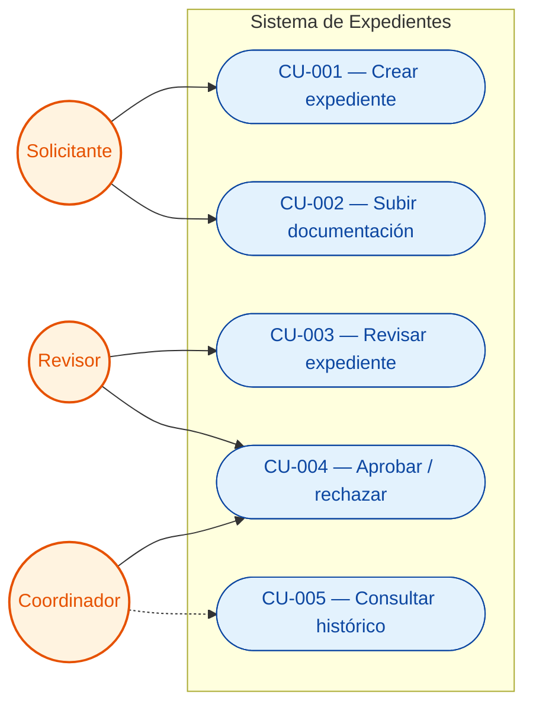
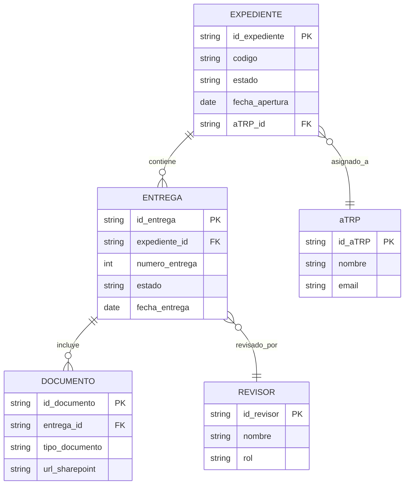
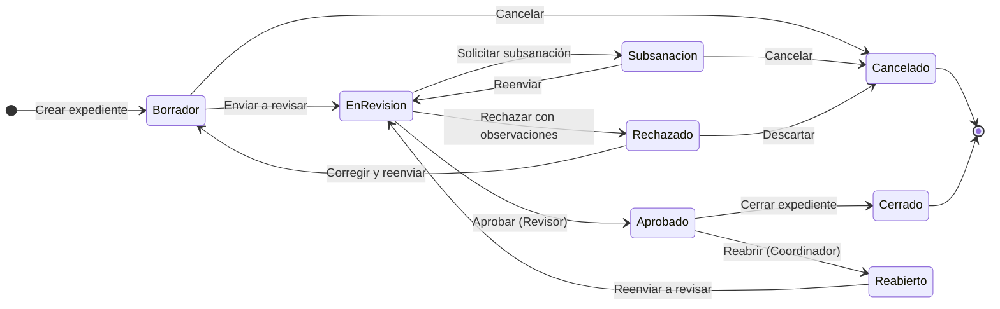

# Diagramas Mermaid para el DDF

Esta referencia cubre los **3 tipos de diagrama Mermaid** del DDF (el flujo del proceso de la
Sección 6 lo dibuja la skill `appian-diagramas-bpmn` en draw.io) y el
**workflow de validación + render a PNG** para incrustarlos en el `.docx`.

Lee la sección que necesites según el diagrama a generar:

- [Workflow general](#workflow-general-escribir--validar-y-renderizar--incrustar) — cómo
  validar el Mermaid y obtener el PNG (válido para los 3 tipos).
- [1. Flujo del proceso](#1-flujo-del-proceso-sección-6-no-es-mermaid) — Sección 6: skill `appian-diagramas-bpmn`.
- [2. Diagrama de casos de uso](#2-diagrama-de-casos-de-uso-sección-7) — Sección 7.
- [3. erDiagram (modelo de datos)](#3-erdiagram-modelo-de-datos-sección-10) — Sección 10.
- [4. stateDiagram-v2 (ciclo de vida)](#4-statediagram-v2-ciclo-de-vida-sección-11) — Sección 11.

---

## Workflow general: escribir → validar y renderizar → incrustar

Patrón **obligatorio** para cualquier diagrama del DDF. Todo se hace en el
equipo: el contenido del diagrama es información del cliente y **no se envía a
servicios externos** (mermaid.live, mermaid.ink, kroki…).

### Paso 1 — Escribir el `.mmd`

Guarda cada diagrama en `diagramas/<nombre>.mmd` dentro de la carpeta de trabajo
del análisis (no en `/tmp`) y copia el mismo código en el bloque ```` ```mermaid ````
de la sección correspondiente del `ddf.md`. Nombres: `cu`, `er`, `estados-<entidad>`.

### Paso 2 — Validar y renderizar a PNG

```bash
python3 <skill>/scripts/render_mermaid.py diagramas/*.mmd          # valida y genera diagramas/<nombre>.png
python3 <skill>/scripts/render_mermaid.py diagramas/er.mmd --check # solo valida
```

`<skill>` es la carpeta de esta skill (en Windows, `python` en vez de `python3`).
El script usa la copia de Mermaid incluida en `assets/` y un navegador headless
del propio equipo (Chromium de Playwright, Chrome o Edge). Códigos de salida:

- `0` todo correcto.
- `1` algún diagrama tiene un error de sintaxis: el mensaje indica la línea.
  **Corrige el código y vuelve a ejecutarlo**; nunca incrustes un diagrama que
  no ha validado.
- `2` falta un requisito (Playwright para Python o un navegador): el mensaje dice
  qué instalar. Díselo al usuario y sigue con el fallback.

Revisa cada PNG con Read antes de incrustarlo: textos cortados, nodos
solapados o un flujo ilegible por tamaño se corrigen dividiendo el diagrama.

**Fallback sin navegador**: deja el bloque Mermaid en el `ddf.md` y, en el docx,
el código en un bloque monoespaciado con la nota «Diagrama pendiente de
renderizar (requisito: Playwright + navegador)». Añade en Sec 17 un punto
🟡 IMPORTANTE. No lo pegues en webs públicas para verlo.

### Paso 3 — Enlazar la imagen en el `ddf.md`

Justo después de cada bloque ```` ```mermaid ````, una línea con su imagen:

```

```

`scripts/ddf_docx.js` sustituye el bloque por la imagen al generar el Word y la
numera como `Figura N — pie`. Si el PNG no existe, deja el código con el aviso
«Diagrama pendiente de renderizar».

---

## 1. Flujo del proceso (Sección 6): no es Mermaid

El diagrama del proceso lo dibuja la skill `appian-diagramas-bpmn` en draw.io, con carriles y
formas BPMN, y se puede editar a mano (también en una reunión con el cliente). Formato,
órdenes y convenciones: su `SKILL.md`. En el `ddf.md` va solo la imagen:
``.

---

## 2. Diagrama de casos de uso (Sección 7)

Mermaid no tiene un tipo nativo de "Use Case Diagram" (a lo UML), así que
usamos un `flowchart LR` con dos columnas visuales: actores a la izquierda
(círculos) y casos de uso a la derecha (elipses). Las líneas representan
"actor participa en CU".

Útil para que el cliente vea de un vistazo qué hace cada rol en el sistema.
**No reemplaza la ficha de cada CU** — la complementa.

### Convenciones

- **Actores**: círculo `(("Nombre del rol"))` con `:::actor`
- **Casos de uso**: elipse `(["CU-XXX — Nombre del caso"])` con `:::cu`
- **Subsistema** (opcional): `subgraph Sistema` que envuelve todos los CU
- Conexión actor → CU: línea simple `-->`. Si el actor solo consulta (sin
  modificar), usar `-.->` punteada.

### classDef

```
classDef actor fill:#FFF3E0,color:#E65100,stroke:#E65100,stroke-width:2px
classDef cu fill:#E3F2FD,color:#0D47A1,stroke:#0D47A1
```

### Plantilla completa



---

## 3. erDiagram (modelo de datos) (Sección 10)

Mermaid soporta diagramas entidad-relación de forma nativa con `erDiagram`.
Úsalo para visualizar las entidades del modelo funcional y sus cardinalidades.

### Sintaxis de relaciones

| Símbolo izquierda | Símbolo derecha | Significado |
|-------------------|-----------------|-------------|
| `\|\|` | `\|\|` | Uno a uno |
| `\|\|` | `o{` | Uno a cero-o-muchos |
| `\|\|` | `\|{` | Uno a uno-o-muchos |
| `}o` | `o{` | Muchos a muchos |

Las cardinalidades se escriben así: `ENTIDAD_A ||--o{ ENTIDAD_B : "verbo"`

### Convenciones

- **Nombres de entidad**: MAYÚSCULAS y sin espacios — `EXPEDIENTE`, `aTRP`,
  `ENTREGA`. Si el cliente usa una palabra concreta, respétala exactamente.
- **Atributos por entidad**: solo los que las transcripciones mencionan o que
  se derivan de forma directa. **Prohibido inventar campos de auditoría
  técnica sin evidencia.**
- **Tipos**: `string`, `int`, `date`, `decimal`, `bool`, o el tipo Appian si el
  cliente lo mencionó (`Text`, `Number (Integer)`, `Date and Time`, etc.).
- **PK / FK**: marca claves con `PK` y `FK` al final del atributo.

### Plantilla completa



### Cuándo NO usar erDiagram

Si una entidad no tiene aún atributos definidos (solo se mencionó el nombre),
no la fuerces en el diagrama con campos inventados. Mejor déjala fuera del
erDiagram y márcala en la tabla de relaciones del DDF como "pendiente de
sesión de modelo de datos".

---

## 4. stateDiagram-v2 (ciclo de vida) (Sección 11)

Para cada entidad principal con ciclo de vida, genera un `stateDiagram-v2` que
muestre estados y transiciones. Es el complemento visual de las tablas de
estados/transiciones de la Sección 11.

### Convenciones

- **Estado inicial**: `[*] --> NombreEstado`
- **Estado final**: `NombreEstado --> [*]` (uno por cada cierre de negocio
  distinto, igual que en BPM no se mezclan finales)
- **Nombre del estado**: usar el **nombre de negocio**, no técnico.
  ✅ "En revisión" / ❌ "REV". Si el nombre tiene espacios o tildes, declara
  el estado con su etiqueta: `state "En revisión" as EnRevision`; si no, el
  diagrama muestra el identificador («EnRevision») en vez del nombre.
- **Etiqueta de transición**: `acción + actor` o solo `acción` si es obvia.
  ✅ `--> EnRevision : Enviar a revisión`
- **Estados compuestos**: usar `state Nombre { ... }` si el ciclo tiene
  sub-estados (ej. "En revisión" con sub-estados "Asignada / En curso").

### Plantilla completa (entidad Expediente)



### Regla de coherencia con Sección 11

Toda transición del diagrama debe aparecer también en la **tabla de
transiciones** (estado origen / evento / estado destino / actor / condición).
Si una transición no está en la tabla, falta documentarla — el diagrama no
puede tener flechas "huérfanas" sin explicación textual.

---

## Tabla resumen — qué diagrama va en qué sección

| Sección DDF | Tipo Mermaid | Cuándo incluir | Cuándo omitir |
|-------------|--------------|----------------|---------------|
| 6 — Flujo BPM | draw.io (skill `appian-diagramas-bpmn`) | Siempre. Es la sección central. | Nunca: si no hay flujo, falta info crítica. |
| 7 — Casos de uso | `flowchart LR` (actor↔CU) | Cuando hay ≥3 actores o ≥6 CUs. | Si solo hay 1 actor y 2 CUs, la tabla basta. |
| 10 — Modelo de datos | `erDiagram` | Cuando ≥2 entidades tienen atributos definidos. | Si todas las entidades están en ❓. |
| 11 — Estados | `stateDiagram-v2` | Cuando una entidad tiene ≥3 estados. | Entidades sin ciclo de vida (catálogos, etc.). |
