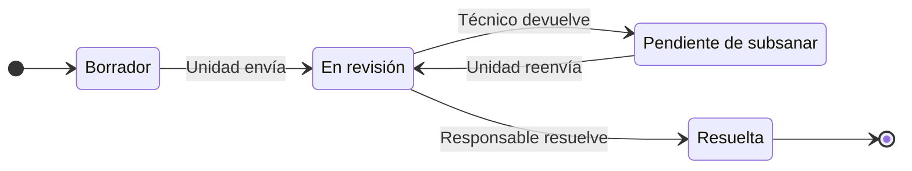
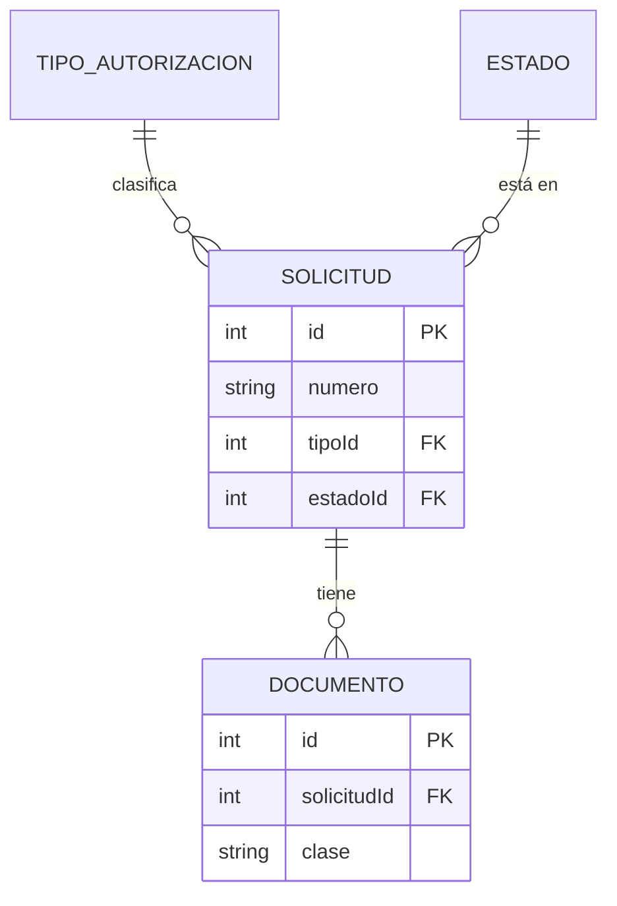

# Diagramas de estados y de datos (Mermaid)

El proceso lo dibuja `appian-diagramas-bpmn` en draw.io. Con Mermaid se dibujan dos cosas:

| Diagrama | Dónde | Cuándo |
|---|---|---|
| Estados (`stateDiagram-v2`) | funcional §3, junto a las tablas de estados | Una entidad con 3 o más estados |
| Datos (`erDiagram`) | técnico §3, al principio | 3 o más record types relacionados |

Todo se hace en el equipo: el contenido es del cliente y no se envía a servicios externos (mermaid.live,
mermaid.ink, kroki…).

## Cómo

1. Escribe `analisis/diagramas/<nombre>.mmd` (`estados-<entidad>`, `datos`).
2. Valida y pinta con el pintor de `appian-diagramas-bpmn`, que está junto a esta skill:
   ```bash
   python3 <skill>/../appian-diagramas-bpmn/scripts/mermaid.py <p>/analisis/diagramas/*.mmd           # genera los .png
   python3 <skill>/../appian-diagramas-bpmn/scripts/mermaid.py <p>/analisis/diagramas/datos.mmd --check # solo valida
   ```
   Salida 1: error de sintaxis, con la línea; corrige y repite. Salida 2: falta Playwright o un navegador;
   dilo y deja el diagrama para cuando lo haya (el `.mmd` se queda; la imagen falta). Si avisa de que mide más
   de 1.600 px de ancho, ponlo de arriba abajo o pártelo.
3. Mira el PNG con Read: textos cortados o nodos solapados se arreglan partiendo el diagrama.
4. Enlaza la imagen: ``. El Word la numera como
   figura.

## Estados

- Un estado inicial `[*] --> Borrador` y un final por cada cierre de negocio distinto.
- Nombres de negocio, los mismos de la tabla de estados. Con espacios o tildes, se declara la etiqueta:
  `EnRevision: En revisión` (o `state "En revisión" as EnRevision`).
- Transición con la acción y, si no es obvio, quién: `EnRevision --> PendienteSubsanar: Técnico devuelve`.
- Cada flecha está en la tabla de transiciones y cada fila de la tabla tiene su flecha.



## Datos

- Entidades con el nombre del record type sin prefijo y sin espacios (`SOLICITUD`, `DOCUMENTO`).
- Solo la clave, las claves ajenas y los campos que ayudan a entender el modelo; la lista completa está en
  las tablas de campos.
- Relaciones: `||--o{` uno a muchos, `||--||` uno a uno, `}o--o{` muchos a muchos.


