# Acuerdos con Terceras Partes — Diseño funcional

Versión: 1.0 · Estado: borrador

## 1. Objetivo y alcance

AENA suscribe acuerdos con empresas, administraciones públicas y otras entidades: convenios, contratos de colaboración, acuerdos de confidencialidad y protocolos generales de actuación. <!-- ✅ FU-01 §1 -->

La aplicación sirve para registrar los acuerdos, revisarlos en Asesoría Jurídica y seguir su vigencia. Cada acuerdo tiene una ficha con sus datos, sus documentos y su historial. <!-- ✅ FU-01 §1; §4 RF-08 -->

La ERS no deja nada fuera del alcance. <!-- ✅ FU-01 -->

Términos que se usan con un significado preciso:

| Término | Significa |
|---|---|
| Acuerdo | Convenio, contrato de colaboración, acuerdo de confidencialidad o protocolo general de actuación entre AENA y una tercera parte |
| Tercera parte | Empresa, administración pública u otra entidad que suscribe el acuerdo con AENA |
| Unidad promotora | Unidad de AENA que propone el acuerdo y lo da de alta |
| Contenido económico | El acuerdo tiene un importe |

## 2. Perfiles

| Perfil | Quién es | Qué hace en la aplicación |
|---|---|---|
| Gestor de acuerdos | Personal de la unidad promotora | Da de alta los acuerdos, adjunta la documentación y pide la revisión jurídica <!-- ✅ FU-01 §2 --> |
| Revisor jurídico | Personal de Asesoría Jurídica | Aprueba, devuelve con comentarios o rechaza los acuerdos <!-- ✅ FU-01 §2 --> |
| Consulta | Cualquier persona de AENA con acceso a la aplicación | Consulta los acuerdos vigentes <!-- ✅ FU-01 §2 --> |

## 3. Proceso

### 3.1 Alta y revisión de un acuerdo

**ACT-01 — Dar de alta el acuerdo** <!-- ✅ FU-01 §4 RF-05, RF-07 -->

| Quién | Empieza cuando | Pantalla | Plazo |
|---|---|---|---|
| Gestor de acuerdos | La unidad promotora prepara un acuerdo nuevo | PAN-04 | — |

Rellena los datos del acuerdo, del tercero y las condiciones económicas, adjunta la documentación y revisa el resumen. Al enviarlo, el acuerdo pasa a «En revisión jurídica» y Asesoría Jurídica recibe la tarea de revisarlo (AV-01).

**ACT-02 — Resolver la revisión jurídica** <!-- ✅ FU-01 §4 RF-10 -->

| Quién | Empieza cuando | Pantalla | Plazo |
|---|---|---|---|
| Revisor jurídico | El gestor envía el acuerdo | PAN-05 | Por decidir |

Revisa el acuerdo y su documentación y decide. El plazo para resolver está por decidir (pendiente: PC-10).
- Aprobar: el acuerdo pasa a «Pendiente de firma» (pendiente: PC-01) y sigue en ACT-03.
- Devolver para cambios, con comentarios: el acuerdo vuelve al gestor; cómo vuelve está por decidir (pendiente: PC-07).
- Rechazar, con comentarios: el acuerdo termina como «Rechazado».

**ACT-03 — Firmar el acuerdo** <!-- 🔶 FU-01 §3 -->

| Quién | Empieza cuando | Pantalla | Plazo |
|---|---|---|---|
| Por decidir | El acuerdo está «Pendiente de firma» | Por decidir | — |

La ERS solo dice que el acuerdo pasa de «Pendiente de firma» a «Vigente». Quién lo firma y si la firma se registra en la aplicación está por decidir (pendiente: PC-01).

### 3.2 Estados del acuerdo

| Estado | Qué significa |
|---|---|
| Borrador | Acuerdo sin enviar a revisión; cuándo se llega a este estado está por decidir (pendiente: PC-07) <!-- ✅ FU-01 §3 --> |
| En revisión jurídica | Asesoría Jurídica lo está revisando <!-- ✅ FU-01 §4 RF-07 --> |
| Pendiente de firma | Aprobado por Asesoría Jurídica y sin firmar <!-- 🔶 FU-01 §3 --> |
| Vigente | Firmado y dentro de sus fechas <!-- 🔶 FU-01 §3 --> |
| Vencido | Ha pasado su fecha de fin <!-- 🔶 FU-01 §3 --> |
| Rechazado | Asesoría Jurídica lo ha rechazado <!-- ✅ FU-01 §4 RF-10 --> |

| De | A | Quién | Cuándo |
|---|---|---|---|
| — | En revisión jurídica | Gestor de acuerdos | Al enviar el alta (ACT-01) |
| En revisión jurídica | Pendiente de firma | Revisor jurídico | Al aprobar (ACT-02) |
| En revisión jurídica | Borrador | Revisor jurídico | Al devolver para cambios (ACT-02; pendiente: PC-07) |
| En revisión jurídica | Rechazado | Revisor jurídico | Al rechazar (ACT-02) |
| Pendiente de firma | Vigente | Por decidir | Al firmarse (ACT-03; pendiente: PC-01) |
| Vigente | Vencido | Por decidir | Por decidir (pendiente: PC-01) |

### 3.3 Escenarios

**ESC-01 — Convenio aprobado** <!-- 🔶 FU-01 §4 RF-05, RF-10 -->

La unidad promotora de Sevilla da de alta un convenio de prácticas con una universidad, sin contenido económico, y adjunta el texto del acuerdo. El revisor lo aprueba y el acuerdo queda «Pendiente de firma».

Pasos: ACT-01, ACT-02.

**ESC-02 — Contrato devuelto para cambios** <!-- 🔶 FU-01 §4 RF-10 -->

Un contrato de colaboración de 420.000 euros para la eficiencia energética de las terminales llega a Asesoría Jurídica. El revisor lo devuelve con el comentario «Justifique el importe en la memoria». Qué pasa después está por decidir (pendiente: PC-07).

Pasos: ACT-01, ACT-02.

**ESC-03 — Acuerdo rechazado** <!-- 🔶 FU-01 §4 RF-10 -->

Un acuerdo de confidencialidad sobre datos de tráfico llega a revisión. El revisor lo rechaza con el comentario «El objeto del acuerdo requiere licitación pública» y el acuerdo queda «Rechazado».

Pasos: ACT-01, ACT-02.

## 4. Funcionalidades

### Inicio

**HU-01 — Ver los indicadores de la cartera** <!-- ✅ FU-01 §4 RF-01 -->

| Perfil | Pantalla | Paso | Prioridad |
|---|---|---|---|
| Gestor de acuerdos, Revisor jurídico | PAN-01 | — | Imprescindible |

Como gestor o revisor, quiero ver al entrar cómo está la cartera de acuerdos para saber qué necesita atención.

Si Consulta también ve los indicadores está por decidir (pendiente: PC-05). Qué suma el importe comprometido, también (pendiente: PC-16).

Se acepta si:
- `HU-01.1` La página de inicio muestra cuántos acuerdos están vigentes, cuántos pendientes de revisión y cuántos vencen en los próximos 90 días, y el importe comprometido.

**HU-02 — Ver mis tareas pendientes** <!-- ✅ FU-01 §4 RF-02 -->

| Perfil | Pantalla | Paso | Prioridad |
|---|---|---|---|
| Revisor jurídico, Gestor de acuerdos | PAN-01 | — | Imprescindible |

Como revisor, quiero ver mis tareas al entrar para resolverlas sin buscarlas.

El gestor solo tiene tareas si la devolución para cambios le genera una (pendiente: PC-07).

Se acepta si:
- `HU-02.1` La página de inicio muestra las tareas pendientes de quien entra.
- `HU-02.2` Al pulsar una tarea se abre su pantalla.

### Acuerdos

**HU-03 — Buscar, filtrar y exportar acuerdos** <!-- ✅ FU-01 §4 RF-03 -->

| Perfil | Pantalla | Paso | Prioridad |
|---|---|---|---|
| Gestor de acuerdos, Revisor jurídico, Consulta | PAN-02 | — | Imprescindible |

Como gestor, quiero buscar y filtrar los acuerdos y descargarlos en Excel para encontrar uno sin recorrer la lista entera.

Se aplica RB-03. Las columnas de la lista están por decidir (pendiente: PC-02), y cómo funcionan los filtros (pendiente: PC-08).

Se acepta si:
- `HU-03.1` Se puede buscar por texto y filtrar por estado, tipo de acuerdo y aeropuerto o unidad.
- `HU-03.2` Con los tres filtros, la lista solo enseña los acuerdos que cumplen los tres.
- `HU-03.3` La lista filtrada se descarga en Excel (DOC-01).

**HU-04 — Abrir la ficha desde la lista** <!-- ✅ FU-01 §4 RF-04 -->

| Perfil | Pantalla | Paso | Prioridad |
|---|---|---|---|
| Gestor de acuerdos, Revisor jurídico, Consulta | PAN-02 | — | Imprescindible |

Como gestor, quiero abrir un acuerdo desde la lista para ver todos sus datos.

Se acepta si:
- `HU-04.1` Al pulsar un acuerdo de la lista se abre su ficha (PAN-03).

### Alta

**HU-05 — Dar de alta un acuerdo por pasos** <!-- ✅ FU-01 §4 RF-05 -->

| Perfil | Pantalla | Paso | Prioridad |
|---|---|---|---|
| Gestor de acuerdos | PAN-04 | ACT-01 | Imprescindible |

Como gestor, quiero dar de alta el acuerdo por pasos y revisarlo antes de enviarlo para no enviar datos incompletos.

Se aplican RB-01 y RB-02.

Se acepta si:
- `HU-05.1` El alta tiene cinco pasos: datos generales, tercero, condiciones económicas, documentación y resumen.
- `HU-05.2` No se pasa al paso siguiente con un dato obligatorio vacío.
- `HU-05.3` El resumen muestra todo lo introducido antes de enviar.

**HU-06 — Pedir el importe solo si hay contenido económico** <!-- ✅ FU-01 §4 RF-06 -->

| Perfil | Pantalla | Paso | Prioridad |
|---|---|---|---|
| Gestor de acuerdos | PAN-04 | ACT-01 | Imprescindible |

Como gestor, quiero que el importe solo se pida cuando el acuerdo tiene contenido económico para no rellenar datos que no aplican.

El gestor indica en el alta si el acuerdo tiene contenido económico.

Se acepta si:
- `HU-06.1` Sin contenido económico, el importe no aparece.
- `HU-06.2` Con contenido económico, el importe es obligatorio.

**HU-07 — Enviar el acuerdo a revisión jurídica** <!-- ✅ FU-01 §4 RF-07 -->

| Perfil | Pantalla | Paso | Prioridad |
|---|---|---|---|
| Gestor de acuerdos | PAN-04 | ACT-01 | Imprescindible |

Como gestor, quiero enviar el acuerdo a Asesoría Jurídica al terminar el alta para que lo revise sin más trámites.

Se acepta si:
- `HU-07.1` Al enviar, el acuerdo pasa a «En revisión jurídica» y Asesoría Jurídica recibe la tarea de revisarlo (AV-01).
- `HU-07.2` La aplicación pone el código con la forma ATP-AAAA-NNNN; el gestor no lo escribe.

### Ficha

**HU-08 — Consultar la ficha del acuerdo** <!-- ✅ FU-01 §4 RF-08 -->

| Perfil | Pantalla | Paso | Prioridad |
|---|---|---|---|
| Gestor de acuerdos, Revisor jurídico, Consulta | PAN-03 | — | Imprescindible |

Como gestor, quiero ver en una sola pantalla todo lo de un acuerdo para no buscarlo en otros sitios.

Se aplica RB-03. Qué recoge el historial está por decidir (pendiente: PC-04).

Se acepta si:
- `HU-08.1` La ficha muestra el ciclo de vida, los datos generales, el tercero, las condiciones económicas, los documentos y el historial de cambios.

**HU-09 — Editar los datos generales y añadir documentos** <!-- ✅ FU-01 §4 RF-09 -->

| Perfil | Pantalla | Paso | Prioridad |
|---|---|---|---|
| Gestor de acuerdos | PAN-06, PAN-07 | — | Imprescindible |

Como gestor, quiero corregir los datos generales y añadir documentos desde la ficha para mantener el acuerdo al día.

En qué estados se puede editar está por decidir (pendiente: PC-06). Se aplican RB-01 y RB-02.

Se acepta si:
- `HU-09.1` Desde la ficha, el gestor cambia los datos generales y los guarda.
- `HU-09.2` Desde la ficha, el gestor añade un documento al acuerdo.

**HU-11 — Avisar del vencimiento en la ficha** <!-- ✅ FU-01 §4 RF-11 -->

| Perfil | Pantalla | Paso | Prioridad |
|---|---|---|---|
| Gestor de acuerdos, Revisor jurídico, Consulta | PAN-03 | — | Imprescindible |

Como gestor, quiero ver en la ficha que un acuerdo vigente vence en menos de 90 días para decidir a tiempo si se renueva.

El texto del aviso está por decidir (pendiente: PC-09).

Se acepta si:
- `HU-11.1` La ficha de un acuerdo «Vigente» que vence en menos de 90 días muestra un aviso de vencimiento.
- `HU-11.2` Si faltan 90 días o más para la fecha de fin, o el acuerdo está en otro estado, no hay aviso.

### Revisión jurídica

**HU-10 — Resolver la revisión jurídica** <!-- ✅ FU-01 §4 RF-10 -->

| Perfil | Pantalla | Paso | Prioridad |
|---|---|---|---|
| Revisor jurídico | PAN-05 | ACT-02 | Imprescindible |

Como revisor, quiero aprobar, devolver o rechazar el acuerdo con mis comentarios para que el gestor sepa qué hacer.

Las opciones y adónde lleva cada una están en ACT-02.

Se acepta si:
- `HU-10.1` El revisor elige entre «Aprobar», «Devolver para cambios» y «Rechazar».
- `HU-10.2` Con «Devolver para cambios» o «Rechazar», la decisión no se envía sin comentarios.
- `HU-10.3` Con «Rechazar», el acuerdo pasa a «Rechazado».

### Informes

**HU-12 — Consultar el informe de acuerdos** <!-- ✅ FU-01 §4 RF-12 -->

| Perfil | Pantalla | Paso | Prioridad |
|---|---|---|---|
| Gestor de acuerdos, Revisor jurídico, Consulta | PAN-08 | — | Imprescindible |

Como gestor, quiero ver la cartera agrupada por tipo, estado, mes de alta y aeropuerto para conocer cómo evoluciona.

Quién ve el informe está por decidir (pendiente: PC-05).

Se acepta si:
- `HU-12.1` El informe muestra los acuerdos por tipo y por estado, las altas por mes y el importe por aeropuerto.

### Reglas comunes

| ID | Regla | Historias |
|---|---|---|
| RB-01 | La fecha de fin es posterior a la fecha de inicio. | HU-05, HU-09 <!-- ✅ FU-01 §5 RN-01 --> |
| RB-02 | Los documentos son PDF o DOCX, de 10 MB como máximo cada uno. | HU-05, HU-09 <!-- ✅ FU-01 §5 RN-02 --> |
| RB-03 | Consulta solo ve los acuerdos vigentes (pendiente: PC-03). | HU-03, HU-08 <!-- ✅ FU-01 §2 --> |

## 5. Pantallas

**PAN-01 — Inicio** <!-- ✅ FU-01 §4 RF-01, RF-02 -->

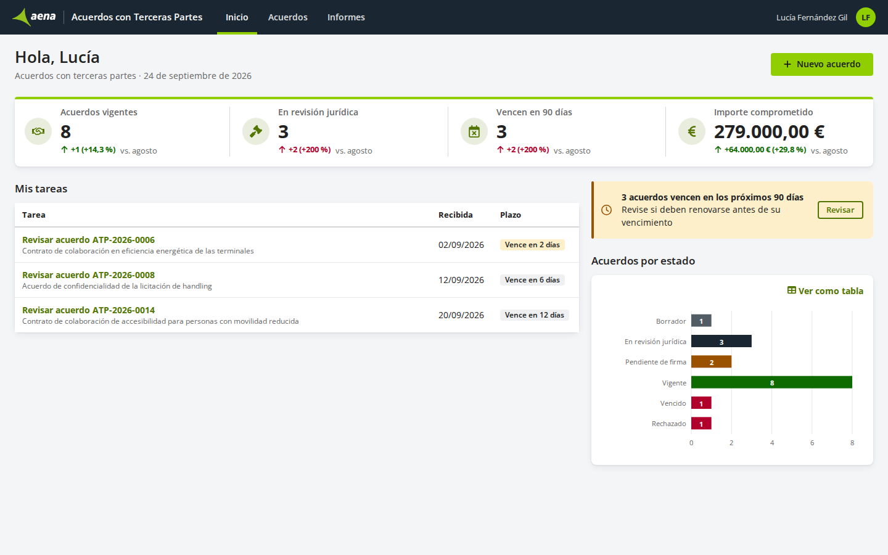

Página de entrada de la aplicación para todos los perfiles.

| Parte | Qué permite | Quién |
|---|---|---|
| Indicadores | Ver los acuerdos vigentes, en revisión y que vencen en 90 días, y el importe comprometido | Gestor de acuerdos, Revisor jurídico |
| Mis tareas | Ver las tareas pendientes y abrirlas | Todos |
| Nuevo acuerdo | Empezar el alta de un acuerdo | Gestor de acuerdos |

Historias: HU-01, HU-02.

**PAN-02 — Acuerdos** <!-- ✅ FU-01 §4 RF-03, RF-04 -->

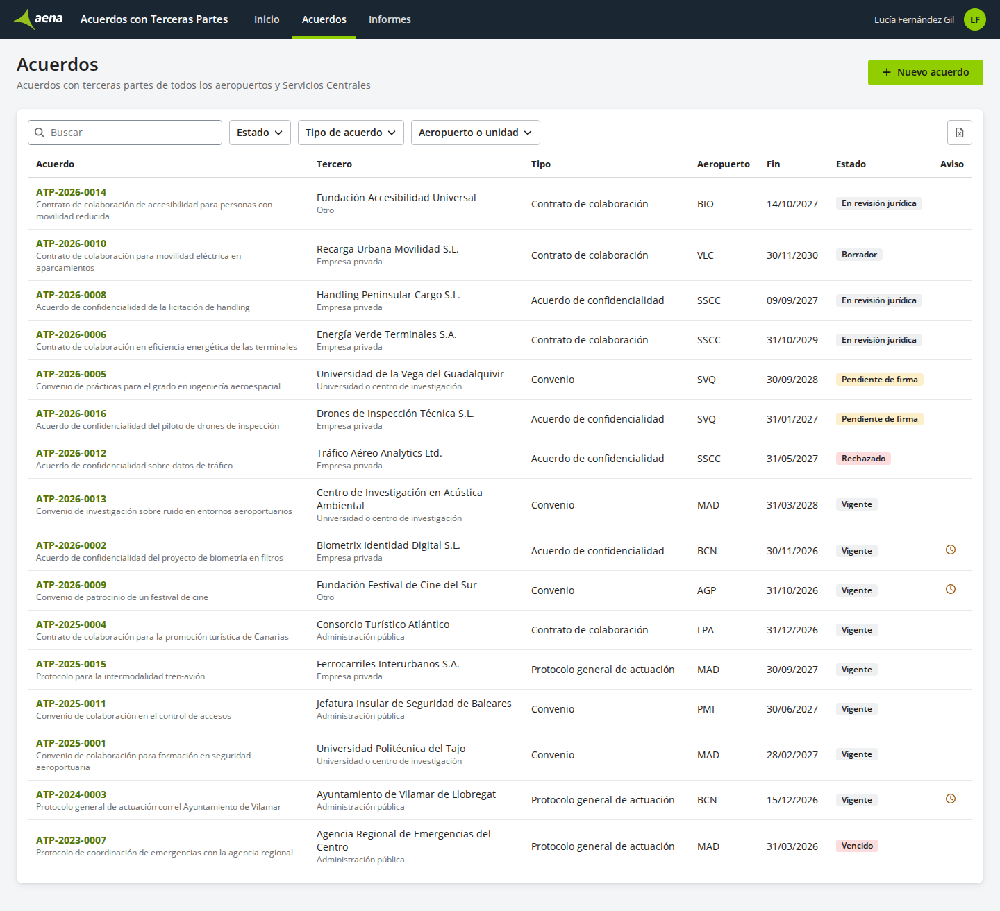

Lista de los acuerdos. Se abre desde el menú de la aplicación.

| Parte | Qué permite | Quién |
|---|---|---|
| Búsqueda y filtros | Buscar por texto y filtrar por estado, tipo de acuerdo y aeropuerto o unidad | Todos |
| Lista | Ver los acuerdos y abrir su ficha | Todos |
| Exportar | Descargar la lista filtrada en Excel | Todos |
| Nuevo acuerdo | Empezar el alta de un acuerdo | Gestor de acuerdos |

Historias: HU-03, HU-04.

**PAN-03 — Ficha del acuerdo** <!-- ✅ FU-01 §4 RF-08, RF-09, RF-11 -->

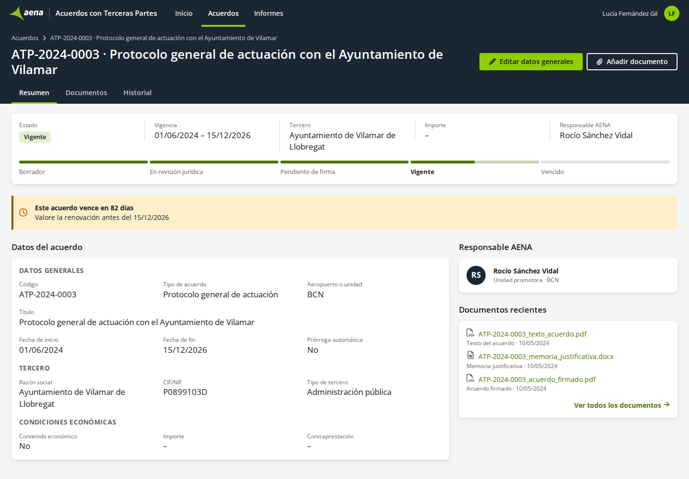

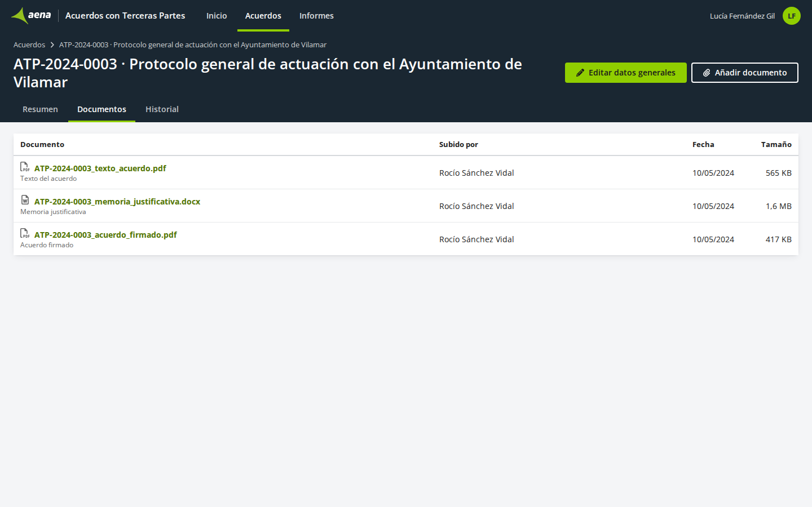

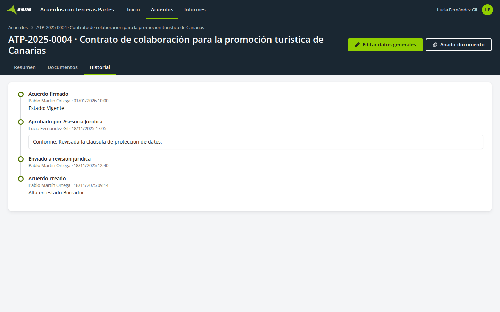

Todo lo de un acuerdo. Se abre desde la lista.

| Parte | Qué permite | Quién |
|---|---|---|
| Ciclo de vida | Ver el estado del acuerdo y por cuáles ha pasado | Todos |
| Aviso de vencimiento | Ver que un acuerdo vigente vence en menos de 90 días | Todos |
| Datos generales | Ver los datos generales del acuerdo | Todos |
| Tercero | Ver los datos del tercero | Todos |
| Condiciones económicas | Ver si tiene contenido económico, el importe y la contraprestación | Todos |
| Documentos | Ver y descargar los documentos del acuerdo | Todos |
| Historial de cambios | Ver los cambios del acuerdo | Todos |
| Editar datos generales | Cambiar los datos generales (PAN-06) | Gestor de acuerdos |
| Añadir documento | Adjuntar un documento (PAN-07) | Gestor de acuerdos |

Historias: HU-08, HU-09, HU-11.

**PAN-04 — Alta de acuerdo** <!-- ✅ FU-01 §4 RF-05, RF-06, RF-07 -->

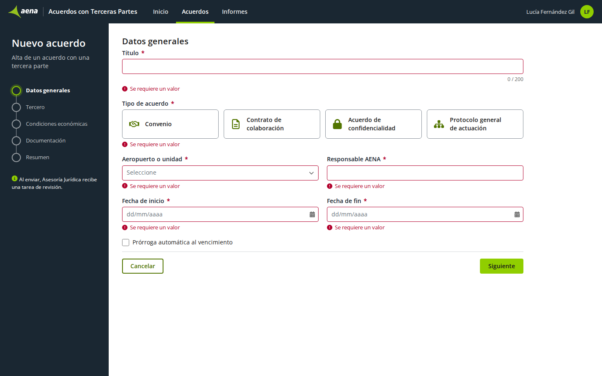

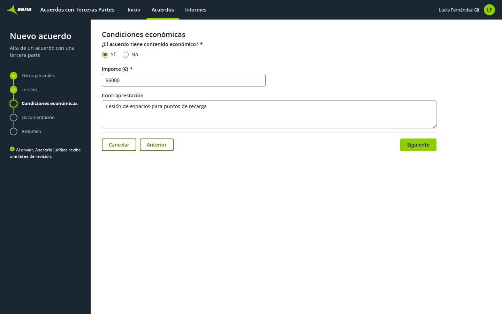

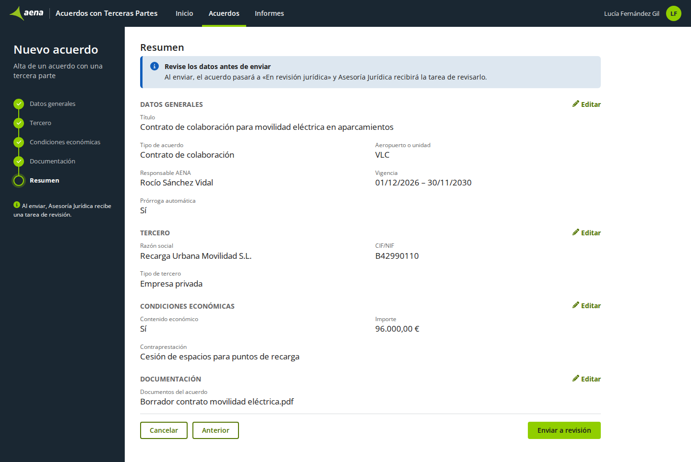

Alta de un acuerdo por pasos. Se abre con «Nuevo acuerdo» desde Inicio o desde la lista.

| Parte | Qué permite | Quién |
|---|---|---|
| Datos generales | Escribir los datos generales del acuerdo | Gestor de acuerdos |
| Tercero | Escribir los datos del tercero | Gestor de acuerdos |
| Condiciones económicas | Indicar si tiene contenido económico, el importe y la contraprestación | Gestor de acuerdos |
| Documentación | Adjuntar los documentos del acuerdo | Gestor de acuerdos |
| Resumen | Revisar lo introducido y enviar el acuerdo a revisión jurídica | Gestor de acuerdos |

Historias: HU-05, HU-06, HU-07.

**PAN-05 — Revisión jurídica** <!-- ✅ FU-01 §4 RF-10 -->

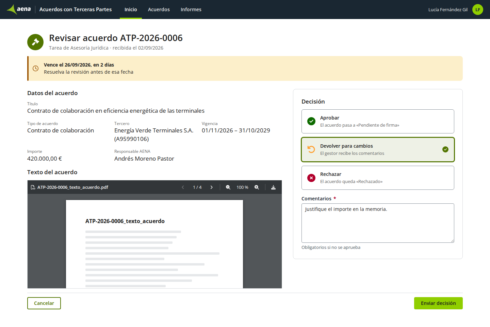

Tarea del revisor. Se abre desde sus tareas, en Inicio.

| Parte | Qué permite | Quién |
|---|---|---|
| Datos del acuerdo | Ver los datos y el texto del acuerdo | Revisor jurídico |
| Decisión | Aprobar, devolver para cambios o rechazar, con comentarios | Revisor jurídico |

Historias: HU-10.

**PAN-06 — Editar datos generales** <!-- ✅ FU-01 §4 RF-09 -->

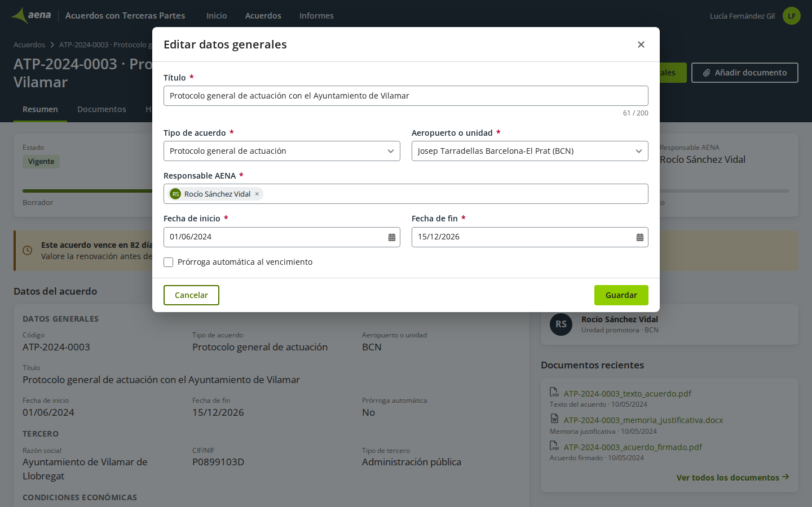

Ventana sobre la ficha del acuerdo. Se abre con «Editar datos generales».

| Parte | Qué permite | Quién |
|---|---|---|
| Datos generales | Cambiar los datos generales y guardarlos | Gestor de acuerdos |

Historias: HU-09.

**PAN-07 — Añadir documento** <!-- ✅ FU-01 §4 RF-09 -->

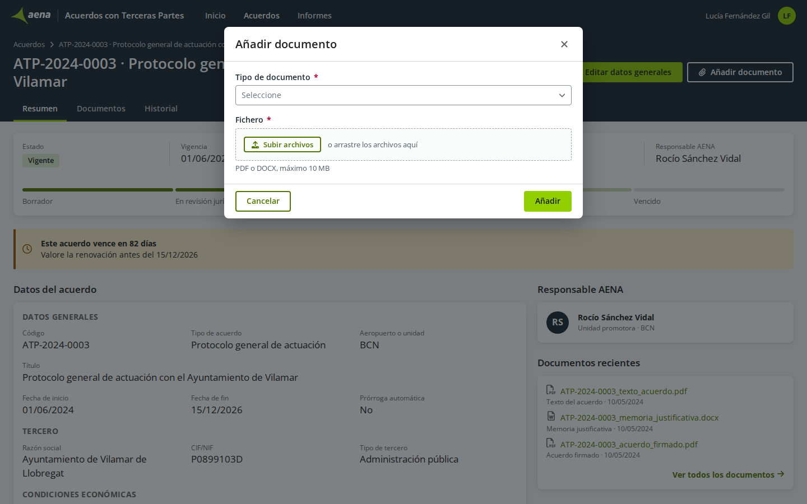

Ventana sobre la ficha del acuerdo. Se abre con «Añadir documento».

| Parte | Qué permite | Quién |
|---|---|---|
| Documento | Adjuntar un documento al acuerdo | Gestor de acuerdos |

Historias: HU-09.

**PAN-08 — Informe de acuerdos** <!-- ✅ FU-01 §4 RF-12 -->

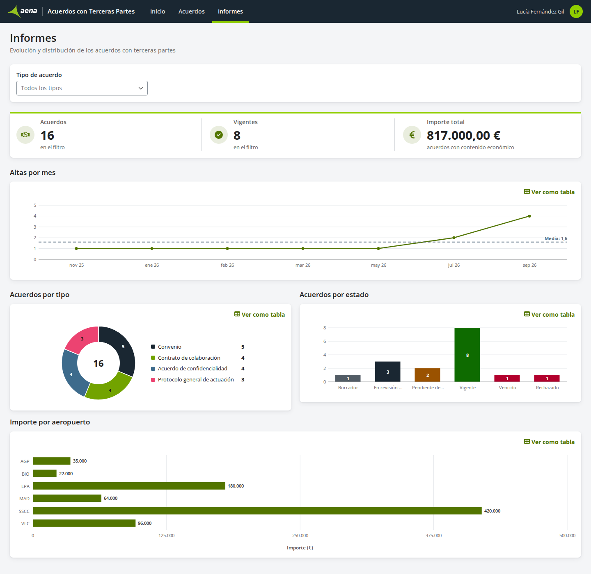

Análisis de la cartera de acuerdos. Se abre desde el menú de la aplicación.

| Parte | Qué permite | Quién |
|---|---|---|
| Por tipo | Ver cuántos acuerdos hay de cada tipo | Todos |
| Por estado | Ver cuántos acuerdos hay en cada estado | Todos |
| Altas por mes | Ver cuántos acuerdos se dan de alta cada mes | Todos |
| Importe por aeropuerto | Ver el importe de los acuerdos de cada aeropuerto o unidad | Todos |

Historias: HU-12.

## 6. Información que gestiona

### 6.1 Acuerdo

Cada acuerdo con una tercera parte. Cuántos se registran al año y cuánto tiempo se conservan está por decidir (pendiente: PC-12).

| Dato | Qué significa | Formato | Obligatorio | Dónde se ve |
|---|---|---|---|---|
| Código | Identifica el acuerdo; lo pone la aplicación | ATP-AAAA-NNNN | Automático | PAN-02, PAN-03, PAN-05 <!-- ✅ FU-01 §3 --> |
| Título | Qué se acuerda, en una línea | Texto, hasta 200 caracteres | Sí | PAN-02, PAN-03, PAN-04, PAN-05, PAN-06 <!-- ✅ FU-01 §3 --> |
| Tipo de acuerdo | Clase de acuerdo | Lista de tipos de acuerdo | Sí | PAN-02, PAN-03, PAN-04, PAN-05, PAN-06 <!-- ✅ FU-01 §3 --> |
| Tercero | Razón social de la tercera parte | Texto | Sí | PAN-03, PAN-04, PAN-05 <!-- ✅ FU-01 §3 --> |
| CIF/NIF del tercero | Identificación fiscal de la tercera parte | Texto | Sí | PAN-03, PAN-04, PAN-05 <!-- ✅ FU-01 §3 --> |
| Tipo de tercero | Clase de tercera parte | Lista de tipos de tercero | Sí | PAN-03, PAN-04 <!-- ✅ FU-01 §3 --> |
| Aeropuerto o unidad | Dónde se aplica el acuerdo | Código IATA del aeropuerto o Servicios Centrales | Sí | PAN-02, PAN-03, PAN-04, PAN-06 <!-- ✅ FU-01 §3 --> |
| Responsable AENA | Persona de AENA que responde del acuerdo | Persona | Sí | PAN-03, PAN-04, PAN-05, PAN-06 <!-- ✅ FU-01 §3 --> |
| Fecha de inicio | Día en que empieza a aplicarse | Fecha | Sí | PAN-03, PAN-04, PAN-05, PAN-06 <!-- ✅ FU-01 §3 --> |
| Fecha de fin | Día en que deja de aplicarse | Fecha posterior a la de inicio (RB-01) | Sí | PAN-03, PAN-04, PAN-05, PAN-06 <!-- ✅ FU-01 §3 --> |
| Prórroga automática | El acuerdo se prorroga solo al llegar la fecha de fin | Sí o No | No | PAN-03, PAN-04, PAN-06 <!-- ✅ FU-01 §3 --> |
| Contenido económico | El acuerdo tiene importe | Sí o No | Sí | PAN-03, PAN-04 <!-- 🔶 FU-01 §4 RF-06 --> |
| Importe | Importe del acuerdo en euros | Número con dos decimales | Si tiene contenido económico (HU-06) | PAN-03, PAN-04, PAN-05 <!-- ✅ FU-01 §3 --> |
| Contraprestación | Qué aporta cada parte | Texto largo | No | PAN-03, PAN-04 <!-- ✅ FU-01 §3 --> |
| Estado | Punto del proceso en que está (3.2) | Lista de estados | Automático | PAN-02, PAN-03 <!-- ✅ FU-01 §3 --> |
| Fecha de alta | Día en que se dio de alta el acuerdo | Fecha | Automático | PAN-08, agrupada por mes <!-- 🔶 FU-01 §4 RF-12 --> |

Un acuerdo tiene cero o más documentos (6.2) y un historial de cambios (pendiente: PC-04).

### 6.2 Documento

Cada fichero adjunto a un acuerdo. Qué más se guarda de cada documento está por decidir (pendiente: PC-15).

| Dato | Qué significa | Formato | Obligatorio | Dónde se ve |
|---|---|---|---|---|
| Fichero | El documento | PDF o DOCX, hasta 10 MB (RB-02) | Sí | PAN-03, PAN-04, PAN-05, PAN-07 <!-- ✅ FU-01 §5 RN-02 --> |

Cada documento es de un solo acuerdo.

### 6.3 Listas de valores

| Lista | Valores | Quién la mantiene |
|---|---|---|
| Tipo de acuerdo | Convenio, Contrato de colaboración, Acuerdo de confidencialidad, Protocolo general de actuación | Por decidir (PC-13) <!-- ✅ FU-01 §3 --> |
| Tipo de tercero | Empresa privada, Administración pública, Universidad o centro de investigación, Otro | Por decidir (PC-13) <!-- ✅ FU-01 §3 --> |
| Aeropuerto o unidad | Los aeropuertos, por su código IATA, y Servicios Centrales | Por decidir (PC-13) <!-- ✅ FU-01 §3 --> |

## 7. Avisos

| ID | Cuándo | A quién | Qué dice | Cómo llega |
|---|---|---|---|---|
| AV-01 | El gestor envía un acuerdo a revisión | Revisor jurídico | La tarea de revisar el acuerdo; el texto está por decidir (PC-09) | Tarea; si también llega por correo, por decidir (PC-11) <!-- ✅ FU-01 §4 RF-07 --> |

## 8. Documentos e informes

| ID | Qué es | Quién lo genera o lo sube | Cuándo | Formato |
|---|---|---|---|---|
| DOC-01 | Lista de acuerdos | Cualquier perfil, desde la lista | Cuando la descarga | Excel con los filtros aplicados <!-- ✅ FU-01 §4 RF-03 --> |
| DOC-02 | Documentación del acuerdo | Gestor de acuerdos | En el alta y desde la ficha | PDF o DOCX, hasta 10 MB (RB-02) <!-- ✅ FU-01 §4 RF-05, RF-09; §5 RN-02 --> |

## 9. Relación con otros sistemas

No hay: la ERS no menciona ninguno. <!-- ✅ FU-01 -->

## 10. Condiciones de uso

- Personas que la usan, cuántas a la vez y en qué horario: por decidir (pendiente: PC-14).
- Acuerdos al año y tiempo que se conservan: por decidir (pendiente: PC-12).
- Quién mantiene las listas de valores: por decidir (pendiente: PC-13).

## 11. Pendiente de confirmar

| ID | Pregunta | Opciones | A quién | Afecta a |
|---|---|---|---|---|
| PC-01 | ¿Cómo se registra la firma y quién pasa el acuerdo a «Pendiente de firma», «Vigente» y «Vencido»? | Se registran la fecha y los firmantes / Solo se adjunta el acuerdo firmado / La firma queda fuera de la aplicación | Asesoría Jurídica | ACT-02, ACT-03, 3.2 <!-- ❓ FU-01 §3 --> |
| PC-02 | ¿Qué columnas tiene la lista de acuerdos? | Código, título, tercero, tipo, aeropuerto, fecha de fin y estado / Otras | Unidad promotora | HU-03, PAN-02 <!-- ❓ FU-01 §4 RF-03 --> |
| PC-03 | ¿Consulta ve solo los acuerdos vigentes también en la lista y en la ficha? | Sí, en todas las pantallas / En la lista ve todos | Responsable del proyecto en AENA | RB-03 <!-- ❓ FU-01 §2 --> |
| PC-04 | ¿Qué cambios recoge el historial del acuerdo? | Solo los cambios de estado / También cada cambio de dato | Unidad promotora | HU-08, PAN-03 <!-- ❓ FU-01 §4 RF-08 --> |
| PC-05 | ¿Quién ve los indicadores de inicio y el informe? | Todos los perfiles / Solo el gestor y el revisor | Responsable del proyecto en AENA | HU-01, HU-12 <!-- ❓ FU-01 §4 RF-01, RF-12 --> |
| PC-06 | ¿En qué estados puede el gestor editar los datos generales? | Solo antes de enviarlo a revisión / En cualquier estado salvo «Rechazado» | Unidad promotora | HU-09 <!-- ❓ FU-01 §4 RF-09 --> |
| PC-07 | Al devolver para cambios, ¿el gestor recibe una tarea para corregir y reenviar el acuerdo? | Sí, una tarea / No: el acuerdo vuelve a «Borrador» sin tarea | Asesoría Jurídica | ACT-02, HU-02, 3.2 <!-- ❓ FU-01 §4 RF-10 --> |
| PC-08 | ¿Cada filtro de la lista admite un valor o más de uno, y en qué orden sale la lista? | Un valor por filtro / Más de uno | Unidad promotora | HU-03 <!-- ❓ FU-01 §4 RF-03 --> |
| PC-09 | ¿Qué dicen los mensajes de RB-01 y RB-02, el aviso de vencimiento y la tarea de revisión? | Los que propone el prototipo / Otros | Unidad promotora | RB-01, RB-02, HU-11, AV-01 <!-- ❓ FU-01 §5 --> |
| PC-10 | ¿Hay plazo para resolver la revisión jurídica y qué pasa si vence? | Sin plazo / Un plazo en días hábiles con aviso al vencer | Asesoría Jurídica | ACT-02 <!-- ❓ FU-01 §4 RF-10 --> |
| PC-11 | ¿Qué avisos llegan también por correo? | Ninguno / La tarea de revisión / También la decisión al gestor | Unidad promotora | AV-01 <!-- ❓ FU-01 §4 RF-07 --> |
| PC-12 | ¿Cuántos acuerdos se registran al año y cuántos años se conservan? | — | Responsable del proyecto en AENA | 6.1, 10 <!-- ❓ FU-01 --> |
| PC-13 | ¿Quién mantiene las listas de tipos de acuerdo, tipos de tercero y aeropuertos? | Asesoría Jurídica / Un administrador de la aplicación | Responsable del proyecto en AENA | 6.3, 10 <!-- ❓ FU-01 §3 --> |
| PC-14 | ¿Cuántas personas usan la aplicación, cuántas a la vez y en qué horario? | — | Responsable del proyecto en AENA | 10 <!-- ❓ FU-01 --> |
| PC-15 | ¿Qué se guarda de cada documento además del fichero? | El tipo de documento, quién lo sube y la fecha / Solo el fichero | Unidad promotora | 6.2, PAN-07 <!-- ❓ FU-01 §4 RF-08, RF-09 --> |
| PC-16 | ¿El importe comprometido suma solo los acuerdos vigentes o también los pendientes de firma? | Solo vigentes / Vigentes y pendientes de firma | Unidad promotora | HU-01 <!-- ❓ FU-01 §4 RF-01 --> |

## Anexo. Quién puede hacer qué

<!-- Lo genera indice.py derivadas a partir de las pantallas (apartado 5); no se edita a mano. -->

| Pantalla y parte | Gestor de acuerdos | Revisor jurídico | Consulta |
|---|---|---|---|
| PAN-01 Inicio · Indicadores | ✔ | ✔ |  |
| PAN-01 Inicio · Mis tareas | ✔ | ✔ | ✔ |
| PAN-01 Inicio · Nuevo acuerdo | ✔ |  |  |
| PAN-02 Acuerdos · Búsqueda y filtros | ✔ | ✔ | ✔ |
| PAN-02 Acuerdos · Lista | ✔ | ✔ | ✔ |
| PAN-02 Acuerdos · Exportar | ✔ | ✔ | ✔ |
| PAN-02 Acuerdos · Nuevo acuerdo | ✔ |  |  |
| PAN-03 Ficha del acuerdo · Ciclo de vida | ✔ | ✔ | ✔ |
| PAN-03 Ficha del acuerdo · Aviso de vencimiento | ✔ | ✔ | ✔ |
| PAN-03 Ficha del acuerdo · Datos generales | ✔ | ✔ | ✔ |
| PAN-03 Ficha del acuerdo · Tercero | ✔ | ✔ | ✔ |
| PAN-03 Ficha del acuerdo · Condiciones económicas | ✔ | ✔ | ✔ |
| PAN-03 Ficha del acuerdo · Documentos | ✔ | ✔ | ✔ |
| PAN-03 Ficha del acuerdo · Historial de cambios | ✔ | ✔ | ✔ |
| PAN-03 Ficha del acuerdo · Editar datos generales | ✔ |  |  |
| PAN-03 Ficha del acuerdo · Añadir documento | ✔ |  |  |
| PAN-04 Alta de acuerdo · Datos generales | ✔ |  |  |
| PAN-04 Alta de acuerdo · Tercero | ✔ |  |  |
| PAN-04 Alta de acuerdo · Condiciones económicas | ✔ |  |  |
| PAN-04 Alta de acuerdo · Documentación | ✔ |  |  |
| PAN-04 Alta de acuerdo · Resumen | ✔ |  |  |
| PAN-05 Revisión jurídica · Datos del acuerdo |  | ✔ |  |
| PAN-05 Revisión jurídica · Decisión |  | ✔ |  |
| PAN-06 Editar datos generales · Datos generales | ✔ |  |  |
| PAN-07 Añadir documento · Documento | ✔ |  |  |
| PAN-08 Informe de acuerdos · Por tipo | ✔ | ✔ | ✔ |
| PAN-08 Informe de acuerdos · Por estado | ✔ | ✔ | ✔ |
| PAN-08 Informe de acuerdos · Altas por mes | ✔ | ✔ | ✔ |
| PAN-08 Informe de acuerdos · Importe por aeropuerto | ✔ | ✔ | ✔ |
