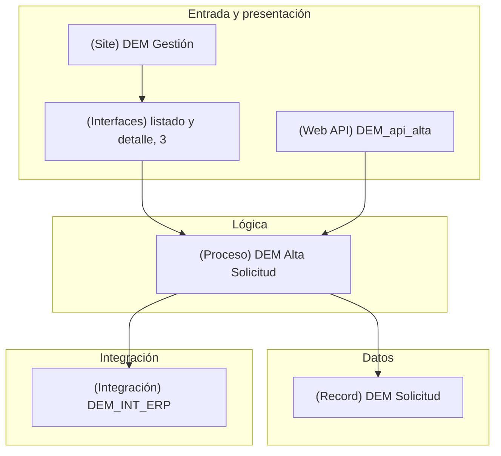

<!--
  Plantilla 02 — Arquitectura de la aplicación (agente interface-analyzer). Borra estos comentarios en el documento final.
  Solo los objetos reales de esta aplicación y sus relaciones; nada de la arquitectura genérica de Appian.
  Capas (las mismas en el diagrama y en las tablas):
    Entrada y presentación: sites, páginas, interfaces, vistas y acciones de record, Web APIs (entradas desde otros sistemas).
    Lógica: process models, expression rules, decisiones, agentes de IA.
    Datos: record types, CDTs, data stores.
    Integración: sistemas conectados e integraciones (llamadas salientes).
    Transversal: constantes y utilidades que usan varias capas (solo en tablas). Grupos y carpetas, en 04 e INVENTARIO.
    Son las mismas capas que layerBreakdown de summary.json (las cifras de 00).
  Diagrama: si existe el .svg, imagen + «Fuente»; si no, el bloque mermaid idéntico al .mmd. Si se partió por capas,
  una imagen por fichero arquitectura-<capa>.svg.
  Secciones sin contenido: se omiten.
-->

# Arquitectura de la aplicación

> **TL;DR**: {{2-3 frases: cómo está montada la aplicación, p. ej. «Un site con 3 páginas lleva a interfaces que leen el record DEM Solicitud; el proceso DEM Alta Solicitud orquesta el alta, llama al ERP y lanza la revisión como subproceso.»}}
> **Volumen**: {{N}} objetos: {{n}} interfaces, {{n}} process models, {{n}} expression rules, {{n}} record types, {{n}} integraciones… **Hallazgos**: {{N (Alta: n)}} — principales: [H-ARQ-01](#hallazgos) (o «sin hallazgos»).

## Vista

{{Una frase: qué muestra el diagrama, p. ej. «Objetos clave por capa y quién llama a quién».}}

Fuente: [arquitectura.mmd](diagrams/arquitectura.mmd)

<!-- Sin SVG (flowchart TD, un subgraph por capa, ≤ 30 nodos; un nodo puede agrupar objetos del mismo papel):

-->

| Capa | Objetos | Núcleo |
|---|---|---|
| Entrada y presentación | {{n: 1 site, 6 interfaces, 1 Web API}} | `{{site}}`, `{{interfaz principal}}` |
| Lógica | {{n: 3 process models, 5 expression rules}} | `{{proceso central}}` |
| Datos | {{n: 2 record types}} | `{{record central}}` |
| Integración | {{n: 1 sistema conectado, 2 integraciones}} | `{{integración}}` |
| Transversal | {{n: 8 constantes}} | `{{constante o regla más usada}}` |

## Detalle

Los objetos más relevantes de cada capa; la lista completa está en [INVENTARIO.md](./INVENTARIO.md). «Ref. entrantes» son las referencias que recibe el objeto en el grafo de dependencias, que suma las del análisis de dependencias de Appian y las encontradas en las definiciones; por eso puede superar el número de dependientes que muestra Appian.

### Entrada y presentación

| Objeto | Tipo | Qué hace | Usa | Ref. entrantes | Ficha |
|---|---|---|---|---|---|
| `{{site}}` | Site | {{Portal de los gestores: listado y alta de solicitudes}} | `{{interfaz}}`, `{{record}}` | {{n}} | [anexo](anexo/site/{{slug}}.md) |
| `{{interfaz}}` | Interfaz | {{Formulario de alta}} | `{{regla}}`, `{{record}}` | {{n}} | [10](./10-pantallas.md) |
| `{{webApi}}` | Web API | {{Alta de solicitudes desde el ERP}} | `{{proceso}}` | {{n}} | [06](./06-apis-expuestas.md) |

### Lógica

| Objeto | Tipo | Qué hace | Usa | Ref. entrantes | Ficha |
|---|---|---|---|---|---|
| `{{proceso}}` | Process model | {{Registra la solicitud y la envía a revisión}} | `{{subproceso}}`, `{{integración}}` | {{n}} | [08](./08-procesos-bpmn/{{slug}}.md) |
| `{{regla}}` | Expression rule | {{Devuelve las solicitudes pendientes}} | `{{record}}` | {{n}} | [anexo](anexo/expressionRule/{{slug}}.md) |

### Datos

| Objeto | Tipo | Qué hace | Usa | Ref. entrantes | Ficha |
|---|---|---|---|---|---|
| `{{record}}` | Record type | {{Solicitudes; tabla `dem_solicitud`}} | `{{record relacionado}}` | {{n}} | [03](./03-modelo-datos.md) |

### Integración

| Objeto | Tipo | Qué hace | Usa | Ref. entrantes | Ficha |
|---|---|---|---|---|---|
| `{{integración}}` | Integración | {{Crea el expediente en el ERP}} | `{{sistema conectado}}` | {{n}} | [05](./05-integraciones-consumidas.md) |

### Transversal

| Objeto | Tipo | Qué hace | Usa | Ref. entrantes | Ficha |
|---|---|---|---|---|---|
| `{{constante}}` | Constante | {{Grupo de gestores, usado en la visibilidad de páginas}} | — | {{n}} | [anexo](anexo/constant/{{slug}}.md) |

### Notas para el mantenimiento

- {{Lo que hay que saber para no romper nada, con evidencia, p. ej. «Toda escritura en DEM Solicitud pasa por el proceso DEM Persistir; no hay escrituras desde interfaces» (`mcp:…`).}}
- {{Buena práctica observada, dicha con palabras, p. ej. «Las llamadas al ERP están encapsuladas en una sola integración».}}

## Hallazgos

| ID | Hallazgo | Severidad | Certeza | Evidencia |
|---|---|---|---|---|
| H-ARQ-01 | {{`DEM_getSolicitudes` (320 líneas) recibe 12 referencias: un cambio afecta a todas las pantallas}} | Media | ✅ | `graph:hubs` |
| H-ARQ-02 | {{`DEM_Old_Form` sin referencias entrantes: posible objeto sin uso}} | Baja | 🔵 | `graph:orphans` |

{{Para cada hallazgo ❓ o 🔵: de qué se deduce y qué lo confirmaría.}}

## Cobertura y límites

- {{Qué no se pudo obtener o verificar, p. ej. «Pocas referencias del análisis de dependencias de Appian: las relaciones salen sobre todo de las definiciones (🔵)».}}
