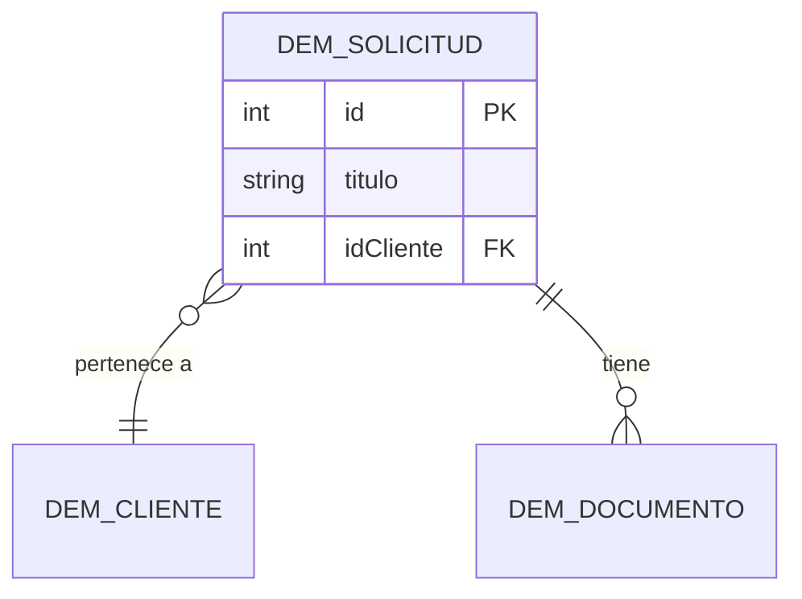

<!--
  Plantilla 03 — Modelo de datos (agente data-modeler). Borra estos comentarios en el documento final.
  Partición de los diagramas (criterio: legibilidad):
    - Hasta ~15 entidades: un único ER, sin subdominios.
    - ~15-30: un ER con las entidades más conectadas + un ER por subdominio.
    - Más de ~30: mapa de subdominios + un ER por subdominio.
  El catálogo (tablas y fichas) cubre el 100 % de records y CDTs; la partición solo afecta a los diagramas.
  Diagramas: si existe el .svg, imagen + «Fuente»; si no, el bloque mermaid idéntico al .mmd.
  Secciones, columnas o filas sin contenido: se omiten (p. ej. sin CDTs no hay tabla de CDTs; sin data stores, no
  hay sección de data stores; sin recuentos, no hay columna «Filas»). Lo que la extracción no trae se dice una vez
  en «Cobertura y límites», no con ❓ en cada celda.
-->

# Modelo de datos

> **TL;DR**: {{2-3 frases: núcleo del modelo, p. ej. «El núcleo es DEM Solicitud, relacionado con DEM Cliente y DEM Documento; todo está sincronizado salvo el catálogo de estados»}}.
> **Volumen**: {{n}} record types, {{n}} CDTs, {{n}} data stores{{; n filas en total (recuento del data fabric)}}{{; n subdominios}}. **Hallazgos**: {{N (Alta: n)}} — principales: [H-DAT-01](#hallazgos) (o «sin hallazgos»).

## Vista

{{Una frase: qué muestra el diagrama, p. ej. «Record types y sus relaciones declaradas».}}

Fuente: [modelo-datos.mmd](diagrams/modelo-datos.mmd)

<!-- Sin SVG:

-->

<!-- Solo si se sustituyó algún nombre en el diagrama: -->
| Nombre real | Nombre en el diagrama |
|---|---|
| `{{DEM Solicitud}}` | `{{DEM_SOLICITUD}}` |

<!-- Con más de ~15 entidades: tras el ER (o el mapa de subdominios), una subsección por subdominio con su ER
     y su tabla resumen: ### Subdominio {{nombre}} ({{n}} entidades) + imagen modelo-datos-{{subdominio}}.svg + Fuente. -->

### Record types

| Record type | Origen | Sincronizado | Tabla o fuente | Campos | Relaciones | Filas |
|---|---|---|---|---|---|---|
| [`{{DEM Solicitud}}`](#{{ancla}}) | Base de datos | Sí 🔵 | `{{dem_solicitud}}` | {{12}} | {{3}} | {{1.234}} |
| [`{{DEM Estado}}`](#{{ancla}}) | Base de datos | No ✅ | `{{dem_estado}}` | {{3}} | {{0}} | — |

<!-- Origen: el de la definición (`sourceType`), en palabras (Base de datos, Servicio web, Proceso…).
     Sincronizado: «Sí ✅/No ✅» si la definición lo dice; «Sí 🔵» si solo consta por figurar en el data fabric;
     «❓» si no consta (si no consta para ninguno, quita la columna y dilo en «Cobertura y límites»).
     Filas: recuento del data fabric. Más de 15 records: una tabla por subdominio. -->

### CDTs

| CDT | Campos | Tabla mapeada | Lo usan | Definición |
|---|---|---|---|---|
| [`{{DEM_Solicitud_CDT}}`](#{{ancla}}) | {{8}} | `{{dem_solicitud}}` | {{2 procesos, 1 interfaz}} | Disponible |

## Detalle

<!-- Índice si hay más de 5 fichas (agrupado por subdominio si los hay): - [DEM Solicitud](#…) · … -->

### `{{DEM Solicitud}}` — {{Solicitud}}

{{1 línea: qué representa y para qué se usa.}}

| Campo | Valor |
|---|---|
| Origen | {{Base de datos, tabla `dem_solicitud`}} |
| Sincronizado | {{Sí 🔵: figura en los metadatos del data fabric}} |
| Filas | {{1.234 (recuento del data fabric)}} |
| Campos | {{12; clave `id`}} |
| Vistas | {{Resumen (`DEM_Resumen`), Historial (`DEM_Historial`)}} |
| Acciones | {{Nueva solicitud → `DEM Alta Solicitud` (lista); Editar → `DEM Editar` (por registro)}} |
| Lo usan | {{4 interfaces y 2 procesos ([02](./02-arquitectura.md))}} |

**Campos clave**

| Campo | Tipo | Clave | Notas |
|---|---|---|---|
| `id` | Número (entero) | PK | — |
| `{{idCliente}}` | Número (entero) | FK | {{Enlace con DEM Cliente}} |
| `{{importe}}` | Decimal | — | {{Importe solicitado}} |

**Relaciones**

| Relación | Tipo | Destino | Campo de enlace | Certeza |
|---|---|---|---|---|
| `{{cliente}}` | Muchos a uno | `{{DEM Cliente}}` | `{{idCliente}}` | ✅ |
| `{{documentos}}` | Uno a muchos | `{{DEM Documento}}` | {{no lo devuelve la extracción}} | 🔵 |

Evidencia: `mcp:recordType/{{nombre}}#{{fields}}` · Certeza: ✅/🔵/❓ · [Definición completa](anexo/recordType/{{slug}}.md)

### `{{DEM_Solicitud_CDT}}`

{{1 línea: para qué se usa.}}

| Campo | Valor |
|---|---|
| Namespace | `{{urn:com:appian:types:DEM}}` |
| Definición | {{Disponible / no la devuelve la extracción ❓}} |
| Tabla mapeada | `{{dem_solicitud}}` |
| Campos | {{8}} |
| Lo usan | {{`DEM Alta Solicitud` (variable de proceso), `DEM_SolicitudForm`}} |

<!-- Tabla de campos solo si la definición está disponible: | Campo | Tipo | Clave | Notas | -->

Evidencia: `mcp:cdt/{{nombre}}{{@dependents}}#{{ubicación}}` · Certeza: ✅/🔵/❓

### Data stores

| Data store | Entidades | Lo usan |
|---|---|---|
| `{{DEM_DS}}` | `{{DEM_Solicitud_CDT}}` | {{`DEM Alta Solicitud`}} |

## Hallazgos

| ID | Hallazgo | Severidad | Certeza | Evidencia |
|---|---|---|---|---|
| H-DAT-01 | {{DEM Documento se consulta por `idSolicitud` pero no tiene relación declarada con DEM Solicitud}} | Baja | 🔵 | `mcp:expressionRule/{{nombre}}#expression (línea {{n}})` |

{{Para cada hallazgo ❓ o 🔵: de qué se deduce y qué lo confirmaría.}}

## Cobertura y límites

- {{Lo que la extracción no trae, una vez: p. ej. «La definición no incluye nulabilidad, longitudes, índices, data source, filtros de usuario ni seguridad por fila».}}
- {{Recuentos: «volúmenes no disponibles: Appian MCP Server no configurado», o qué record types no figuran en el data fabric y por qué puede ser.}}
