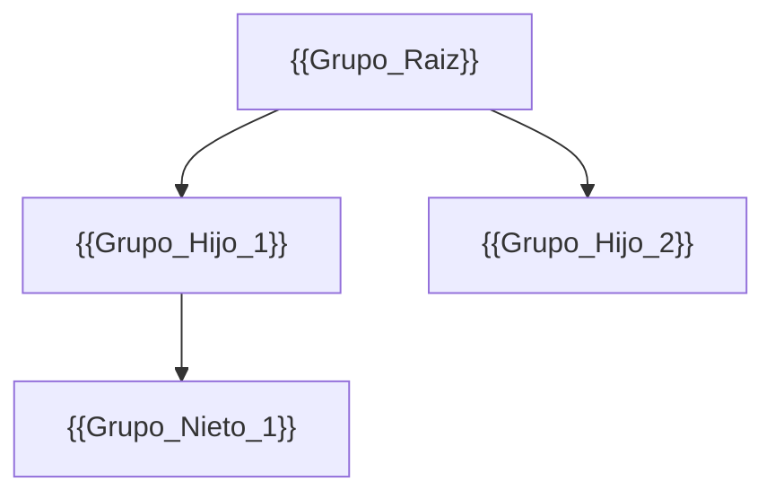

<!--
  Plantilla 04 — Jerarquía de grupos y seguridad
  Árbol de groups + tabla por objeto sensible + matriz RACI + reglas embebidas en SAIL.
-->

# Jerarquía de grupos y seguridad

> Vista de control de acceso: quién puede ver, editar, administrar e iniciar qué.

## Árbol jerárquico de grupos

> Construido a partir de `parentGroup`, `memberGroups` y las aristas `memberGroup` del grafo. Se indica el número de usuarios de cada grupo, nunca sus nombres.

> Diagrama saneado según `references/mermaid-rules.md`. Si hay >30 grupos, sustituir por tabla.

### Tabla de grupos

| Grupo | Tipo | Tiene padres | Descripción / propósito |
|---|---|---|---|
| `{{grupo_1}}` | Custom / System | {{padre}} | {{descripción}} |
| `{{grupo_2}}` | Custom / System | {{padre}} | {{descripción}} |
| `All Users` | System | — | 🔴 Atención: grupo amplio, evitar como permiso explícito |

## Matriz de seguridad por objeto sensible

> Una fila por objeto sensible: Sites, Interfaces, Process Models, Records, Folders, Web APIs. Fuente: seguridad por objeto si alguna herramienta del Dev MCP la devuelve; si no, lo verificable (iniciadores de procesos, visibilidad de páginas y acciones, asignación de tareas). Indicar cuál se ha usado.

| Objeto | Tipo | Viewer | Editor | Administrator | Initiator | Deny |
|---|---|---|---|---|---|---|
| `{{site_1}}` | Site | {{grupos}} | {{grupos}} | {{grupos}} | — | {{grupos_o_vacio}} |
| `{{interface_1}}` | Interface | {{grupos}} | {{grupos}} | {{grupos}} | — | {{grupos}} |
| `{{pm_1}}` | Process Model | {{grupos}} | {{grupos}} | {{grupos}} | {{grupos}} | {{grupos}} |
| `{{record_1}}` | Record Type | {{grupos}} | {{grupos}} | {{grupos}} | — | {{grupos}} |
| `{{webapi_1}}` | Web API | {{grupos}} | {{grupos}} | {{grupos}} | — | {{grupos}} |
| `{{folder_1}}` | Folder | {{grupos}} | {{grupos}} | {{grupos}} | — | {{grupos}} |

### Hallazgos relevantes

- 🔴 **Objetos accesibles por `All Users` / `Everyone` / `Public`:** {{lista o "ninguno"}}.
- 🔴 **Objetos sin Administrator definido:** {{lista o "ninguno"}}.
- 🟡 **Objetos que heredan seguridad de folder y el folder es laxo:** {{lista}}.
- 🔵 **Process Models con Initiator amplio:** {{lista}}.

## Matriz RACI simplificada

> Filas: grupos. Columnas: capacidades funcionales (derivadas de los casos de uso de `01-funcional.md`).

| Grupo \ Capacidad | {{Cap_1: Ver dashboard X}} | {{Cap_2: Iniciar proceso Y}} | {{Cap_3: Administrar record Z}} | {{Cap_4: Aprobar}} |
|---|---|---|---|---|
| `{{grupo_1}}` | R | A | — | — |
| `{{grupo_2}}` | I | R | — | A |
| `{{grupo_3}}` | — | — | A | R |

Leyenda: **R** Responsable · **A** Aprueba · **C** Consultado · **I** Informado.

## Reglas de seguridad embebidas en código

> Detectadas con grep sobre SAIL: `a!isUserMemberOfGroup`, `loggedInUserHasRole`, `fn!loggedInUser`, asignaciones dinámicas de tarea, visibilidad condicional.

| Tipo | Patrón detectado | Dónde | Comportamiento |
|---|---|---|---|
| Visibilidad condicional | `a!isUserMemberOfGroup(loggedInUser(), cons!GRUPO_X)` | `mcp:interface/{{nombre}}#{{ubicacion}}` | El bloque solo es visible para `GRUPO_X` |
| Asignación dinámica | `assignToExpression: rule!{{rule}}` | `mcp:processModel/{{nombre}}#nodes[{{i}}]` | Tarea asignada según expression rule |
| Bypass de seguridad | `if(loggedInUserHasRole("..."), ...)` | `mcp:{{tipo}}/{{nombre}}` | 🟡 Validar comportamiento |

> Si no hay reglas embebidas relevantes, escribir: "No se han detectado reglas de seguridad embebidas en SAIL".

## Grupos sin miembros visibles

> Según los miembros devueltos por el Dev MCP. Si no hubo herramienta de miembros, indicarlo y no asumir que están vacíos.

- `{{grupo_X}}` — Sin miembros. Confirmar con el administrador funcional.

## Resumen rápido

- Grupos totales: {{N}}
- Grupos custom: {{N}}
- Grupos system: {{N}}
- Profundidad máxima del árbol: {{N}}
- Objetos sensibles con seguridad verificada: {{N}}
- Riesgos de seguridad detectados: {{N}} (ver `09-valor-adicional.md`)
