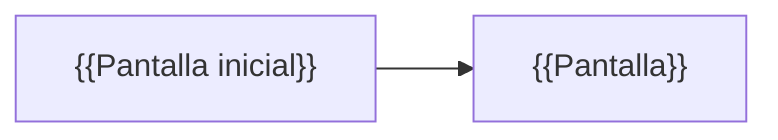

<!--
  Plantilla 10 — Catálogo de pantallas (agente ui-rules-analyzer)
  Una ficha por pantalla con identificador estable PAN-xxx.
  Fuentes: páginas de site, vistas y acciones de record, formularios de inicio y de tarea.
-->

# Catálogo de pantallas

> Qué ve cada usuario, qué datos maneja y qué puede hacer. Escrito para poder reconstruir las pantallas sin abrir la aplicación original.

## TL;DR

{{N}} pantallas: {{n}} páginas del site, {{n}} formularios de procesos, {{n}} vistas de registro. {{Hallazgo principal, p. ej. «3 interfaces sin punto de entrada»}}.

## Mapa de navegación

## Resumen

| ID | Pantalla | Tipo | Quién la ve | Cómo se llega | Estado |
|---|---|---|---|---|---|
| PAN-001 | {{nombre de negocio}} | Página / Formulario de inicio / Tarea / Vista de registro | {{actor}} | {{site > página}} | ✅/🔵/🟡 |

## Fichas

### PAN-001 — {{nombre de negocio}}

| Campo | Valor |
|---|---|
| Propósito | {{una frase}} |
| Quién la ve | {{actor}} · Condición: {{visibilidad o «todos los usuarios de la app»}} |
| Cómo se llega | {{página / acción / tarea}} |
| Implementado en | `{{interfaz}}` (+ `{{interfaces hijas}}`) |
| Estado | ✅/🔵/🟡 — Evidencia: `mcp:interface/{{nombre}}#{{ubicacion}}` |

**Datos**

| Etiqueta | Origen del dato | Editable | Obligatorio |
|---|---|---|---|
| {{Título}} | {{Solicitud.titulo}} | Sí | Sí |

**Validaciones**

- {{En lenguaje de negocio}} → `RN-xxx`

**Acciones**

| Botón / enlace | Qué hace | Condición | Lleva a |
|---|---|---|---|
| {{Enviar}} | {{Guarda la solicitud y la envía a revisión}} | {{siempre}} | {{PAN-xxx / proceso}} |

## Interfaces sin punto de entrada detectado

| Interfaz | Uso probable | Evidencia |
|---|---|---|
| `{{interfaz}}` | {{componente reutilizable / sin uso}} | {{callers en el grafo}} |
