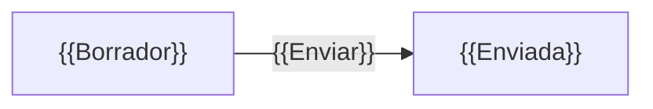

<!--
  Plantilla 11 — Catálogo de reglas de negocio (agente ui-rules-analyzer)
  Una ficha por regla con identificador estable RN-xxx. Sin SAIL en los enunciados.
-->

# Reglas de negocio

> Decisiones y restricciones del negocio que implementa la aplicación, en lenguaje de negocio y con dónde está cada una. Base de los criterios de aceptación de `12-especificacion-reconstruccion.md`.

## TL;DR

{{N}} reglas: {{n}} de validación, {{n}} de cálculo, {{n}} de decisión/enrutamiento, {{n}} de permiso, {{n}} de ciclo de vida, {{n}} de plazo/notificación. {{Hallazgo principal: duplicidades, valores hardcodeados…}}

## Resumen

| ID | Tipo | Enunciado | Dónde se aplica | Estado |
|---|---|---|---|---|
| RN-001 | {{Decisión}} | {{Una solicitud solo se aprueba si el revisor elige «Aprobar».}} | {{PAN-004, proceso Revisar}} | ✅ |

## Fichas

### RN-001 — {{título corto}}

| Campo | Valor |
|---|---|
| Tipo | {{Validación · Cálculo · Decisión/enrutamiento · Permiso · Ciclo de vida · Plazo/notificación}} |
| Enunciado | {{en lenguaje de negocio}} |
| Parámetros | {{valor}} — en `{{constante}}` / 🔴 literal en el código |
| Dónde se aplica | {{PAN-xxx}}, {{proceso}} |
| Implementado en | `{{objeto}}` |
| Duplicidades | {{otros sitios con la misma regla, o «ninguna»}} |
| Estado | ✅/🔵/🟡 — Evidencia: `mcp:{{tipo}}/{{nombre}}#{{ubicacion}}` |

## Ciclo de vida de {{entidad principal}}

## Reglas con valores hardcodeados

| Regla | Valor | Dónde | Recomendación |
|---|---|---|---|
| RN-xxx | {{1000}} | `mcp:...` | {{constante o decisión}} |

## Reglas duplicadas o contradictorias

| Reglas | Problema | Evidencia |
|---|---|---|
| RN-xxx / RN-yyy | {{misma validación con distinto umbral}} | `mcp:...` |
