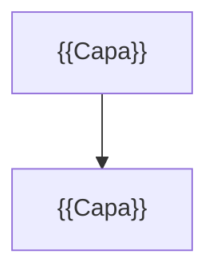

<!--
  Plantilla 13 — Modernización y refactorización (agente rebuild-architect)
  Cada hallazgo con evidencia (objeto real) y fuente oficial (o marcado como heurística).
-->

# Modernización y refactorización

> Diagnóstico técnico de la aplicación frente a las funcionalidades y buenas prácticas actuales de Appian, y propuesta para llevarla a un diseño moderno.

## TL;DR y veredicto

**Veredicto:** {{Mantener y mejorar · Refactorizar por fases · Reconstruir}}

{{Justificación en 3-5 frases: número y gravedad de hallazgos, tamaño, uso real.}}

| Área | Hallazgos | Alta | Media | Baja |
|---|---|---|---|---|
| Datos | {{N}} | {{n}} | {{n}} | {{n}} |
| Procesos | | | | |
| Interfaces | | | | |
| Integraciones | | | | |
| Seguridad | | | | |
| Operación | | | | |

**Versión de Appian del entorno:** {{versión o «no determinada»}}. Recomendaciones verificadas con el Docs MCP: {{sí / no (sin verificar para la versión)}}.

## 1. Diagnóstico

### MOD-001 — {{título}}

| Campo | Valor |
|---|---|
| Área | {{Datos}} |
| Qué hay | {{hecho observable, nº de objetos}} — Evidencia: `mcp:{{tipo}}/{{nombre}}#{{ubicacion}}` |
| Problema | {{Obsoleto / Antipatrón / Diseño mejorable / Deuda}}: {{impacto}} |
| Recomendación | {{funcionalidad o práctica actual}} |
| Fuente | {{URL de docs.appian.com}} · {{o «[heurística de la skill]»}} |
| Esfuerzo | {{S/M/L}} — {{justificación}} |
| Prioridad | {{Alta/Media/Baja}} |

## 2. Oportunidades

| Capacidad | Necesidad que resuelve en esta app | Fuente |
|---|---|---|
| {{Process HQ}} | {{…}} | {{URL}} |

## 3. Arquitectura objetivo

**Principios de diseño:** {{…}}

## 4. Correspondencia objeto actual → propuesto

| Actual | Tipo | Propuesta | Motivo | Acción |
|---|---|---|---|---|
| `{{objeto}}` | {{tipo}} | {{objeto propuesto}} | MOD-xxx / RF-xxx | Mantener / Sustituir / Fusionar / Eliminar / Nuevo |

## 5. Plan de migración

| Fase | Objetivo | Incluye | Depende de | Riesgos y mitigación |
|---|---|---|---|---|
| 0 | {{Mejoras sin refactorizar}} | {{MOD-xxx}} | — | {{…}} |
| 1 | {{…}} | | | |

**Estrategia de datos:** {{coexistencia / migración}}

**Estrategia de pruebas:** los criterios de aceptación de `12-especificacion-reconstruccion.md` son la prueba de equivalencia funcional.

## 6. Decisiones pendientes

| ID | Decisión | Opciones | Quién |
|---|---|---|---|
| DEC-001 | {{…}} | {{…}} | {{Arquitectura / Negocio}} |
