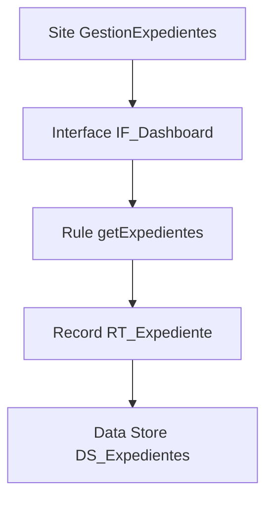
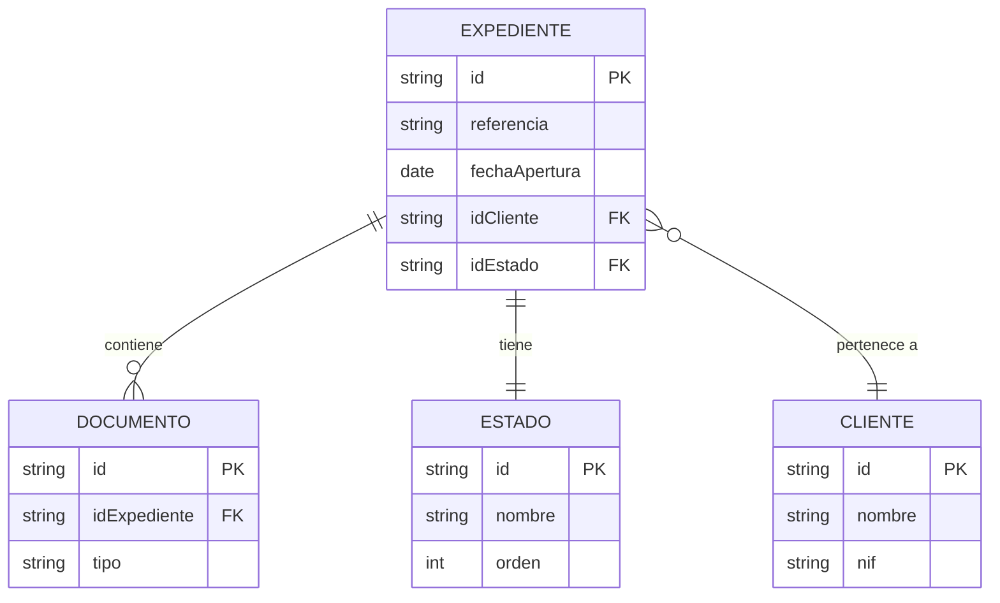
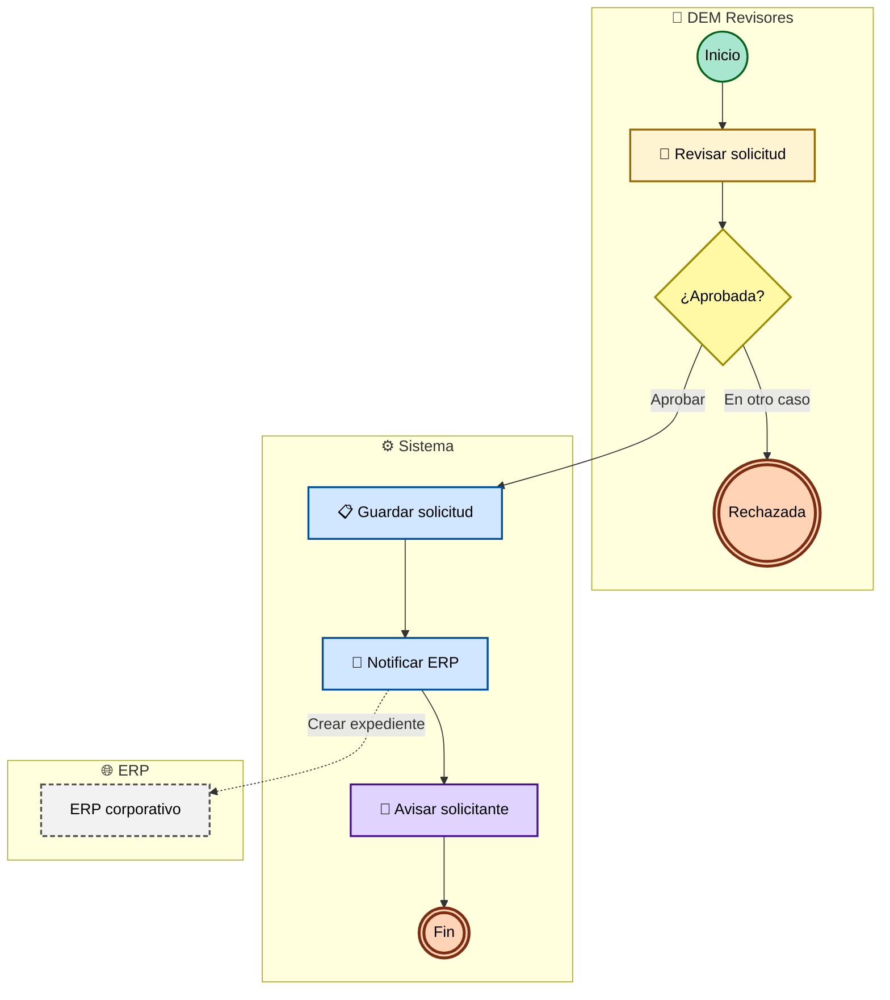
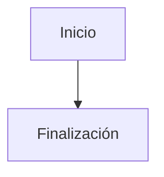
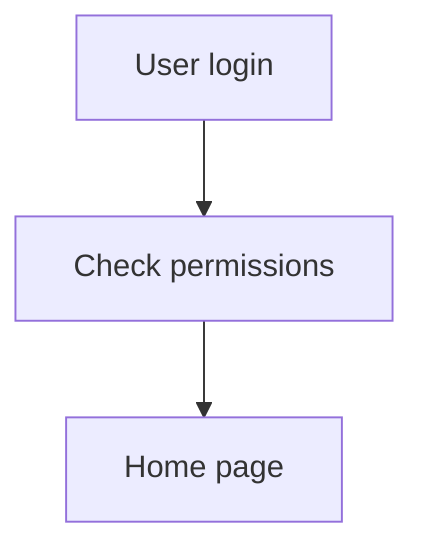
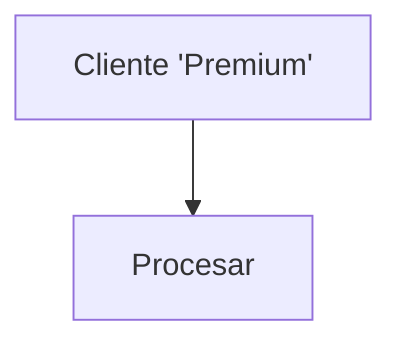

# Reglas obligatorias para Mermaid

Todos los diagramas Mermaid generados deben pasar estas reglas antes de escribirse (las comprueba `python3 <skill>/scripts/validate_mermaid.py <fichero.mmd>`). Si un diagrama no puede sanearse, **sustitúyelo por una tabla equivalente**.

## Ancho: legible a ancho de página

Un diagrama de más de ~1600 px de ancho no se lee en una página; `scripts/render_diagrams.sh` avisa al renderizar. Para evitarlo:

- `flowchart TD` por defecto; `LR` solo si el diagrama es corto (unas 8 cajas en la fila más larga).
- Pocas cajas por fila y etiquetas cortas; etiquetas de arista solo si aportan.
- Si aun así no cabe, parte el diagrama (por capa, subdominio o tramo del flujo).

Un diagrama que dispara el aviso se rehace; no se entrega.

## Subconjunto seguro de Mermaid: tres tipos permitidos

Solo se permiten estos tres tipos. Cada uno tiene reglas específicas; las **reglas comunes** están al final.

---

### Tipo A — `flowchart` (uso general: arquitectura, jerarquía de grupos, mapa de procesos, vistas estructurales)

1. **Cabecera**: la primera línea no vacía es `flowchart TD` (o `flowchart LR` si es corto, ver «Ancho»).
2. **Nodos**:
   - Cuadrado: `N1["Texto"]`
   - Rombo (decisión): `N2{"Pregunta"}`
3. **Conectores**:
   - `-->` flecha sólida.
   - `--->` flecha larga.
   - `-.->` dependencia débil.
   - `-->|"Etiqueta"|` flecha con etiqueta (etiqueta entre comillas dobles).
4. **IDs**: solo `N1`, `N2`, `N3`, … (letra mayúscula N + número).
5. **Etiquetas**: siempre entre comillas dobles, máximo 50 caracteres, sin saltos de línea, sin comillas dobles internas (reemplazar por simples).
6. **Sin `classDef`** ni colores. `subgraph` **solo** para agrupar por capa (`subgraph CP["Presentación"] … end`). Un diagrama por capas (con `subgraph` y sin `classDef`) lo admite el validador sin renombrar los IDs, así que usa ya `N1`, `N2`…
7. **Máximo 30 nodos** por diagrama, también por capas. Si excede, particionar.

---

### Tipo B — `erDiagram` (uso exclusivo: modelo de datos)

1. **Cabecera**: la primera línea no vacía es `erDiagram`.
2. **Entidades**: nombres en `PascalCase` o `SCREAMING_SNAKE_CASE` (sin espacios, guiones, acentos). Si el nombre técnico real tiene caracteres no permitidos, sustitúyelo por el equivalente saneado y deja en la tabla del documento el mapeo "nombre saneado ↔ nombre real".
3. **Relaciones**: solo estas notaciones canónicas:
   - `||--||` uno a uno.
   - `||--o{` uno a muchos (obligatorio).
   - `}o--||` muchos a uno (opcional).
   - `}o--o{` muchos a muchos.
   - Etiqueta de relación entre comillas dobles: `EXPEDIENTE ||--o{ DOCUMENTO : "contiene"`.
4. **Atributos dentro de entidad**: opcionales pero recomendados para campos clave. Si se incluyen, máximo 8 por entidad y formato `tipo nombre [PK|FK] comentario`:
   ```
   EXPEDIENTE {
     string id PK
     string idCliente FK
     date fechaApertura
   }
   ```
5. **Particionamiento del modelo de datos**: no hay un **techo duro** de entidades — los modelos de datos en proyectos Appian reales pueden tener decenas o cientos de entidades, y truncarlos sería peor que mostrarlos. La regla es de **legibilidad**, no de tamaño absoluto:
   - **Hasta ~15 entidades**: un único `erDiagram` global está bien.
   - **De ~15 a ~30**: un diagrama global resumido (solo entidades clave + relaciones principales) **más** diagramas de detalle por subdominio.
   - **Más de ~30**: obligatorio **siempre** partir en sub-diagramas por subdominio funcional. Cada sub-diagrama debe contener un subdominio coherente (típicamente 8-15 entidades). El documento global debe incluir un "mapa de subdominios" como índice navegable.
   - **El criterio no es un número, es la legibilidad**: si el diagrama queda apretado, ilegible o requiere zoom extremo para leerlo, está mal particionado.
   - **Nunca omitas entidades** del catálogo (en las tablas) — partir afecta solo a los diagramas visuales, no al inventario.

---

### Tipo C — diagrama de proceso (uso exclusivo: `08-procesos-bpmn/<slug>.mmd`)

Un `flowchart` con formas, iconos y `classDef` que imitan la notación BPMN 2.0. En `08` va junto al `.bpmn` del mismo proceso (`references/bpmn-mapping.md`), que es el que se abre en Camunda Modeler o bpmn.io. En los documentos se llama «Diagrama del proceso».

1. **Cabecera**: `flowchart TD`; `flowchart LR` solo para procesos cortos (ver «Ancho»).

2. **Formas por elemento** (la correspondencia con cada tipo de nodo Appian está en `bpmn-mapping.md`):

   | Elemento BPMN | Patrón |
   |---|---|
   | Inicio | `Start1((Inicio)):::startNode` |
   | Inicio programado | `Start1((⏰ Inicio)):::startNode` |
   | Inicio por mensaje | `Start1((✉ Inicio)):::startNode` |
   | Tarea de una persona | `T2[👤 Revisar solicitud]:::userTask` |
   | Script | `T3[📜 Calcular total]:::scriptTask` |
   | Escritura de records | `T4[📋 Guardar solicitud]:::dataTask` |
   | Escritura en data store | `T4[💾 Guardar expediente]:::dataTask` |
   | Llamada a integración | `T5[🔌 Notificar ERP]:::serviceTask` |
   | Correo | `T6[📧 Avisar solicitante]:::sendTask` |
   | Subproceso | `S7[➡️ DEM Revisar Solicitud]:::callActivity` |
   | Pasarela exclusiva | `G3{¿Importe gt 1000€?}:::gateway` |
   | Pasarela paralela / inclusiva | `G8{+}:::gateway` / `G8{O}:::gateway` |
   | Fin | `End9(((Fin))):::endNode` |
   | Fin que termina el proceso | `End9(((⊗ Fin))):::endNodeTerm` |
   | Flujo de excepción (solo si la definición lo trae) | `T5 -.->\|"excepción"\| H1` |

3. **IDs**: los del `.bpmn` sin guion bajo, con el id del nodo Appian (`Start1`, `T2`, `G3`, `S7`, `End9`); sistemas externos `Ext1`, `Ext2`…

4. **Carriles**: un `subgraph` por carril (las reglas de carriles están en `bpmn-mapping.md`):

   ```
   subgraph L1["👥 DEM Revisores"]
     T2[👤 Revisar solicitud]:::userTask
   end
   subgraph LS["⚙️ Sistema"]
     T5[🔌 Notificar ERP]:::serviceTask
   end
   ```

5. **Sistema externo**: un `subgraph` con un solo nodo de clase `external` y una flecha discontinua, con la operación, desde la tarea de integración:

   ```
   subgraph P1["🌐 ERP"]
     Ext1[ERP corporativo]:::external
   end
   T5 -.->|"Crear expediente"| Ext1
   ```

6. **`classDef` obligatorio** al final del diagrama (la paleta completa, aunque no se usen todas las clases):

   ```
   classDef startNode fill:#a8e6cf,stroke:#02631a,stroke-width:2px,color:#000
   classDef endNode fill:#ffd3b6,stroke:#7c2d12,stroke-width:3px,color:#000
   classDef endNodeTerm fill:#ffaaa5,stroke:#7c2d12,stroke-width:4px,color:#000
   classDef userTask fill:#fff4d2,stroke:#9c6900,stroke-width:2px,color:#000
   classDef serviceTask fill:#d0e7ff,stroke:#0050a2,stroke-width:2px,color:#000
   classDef dataTask fill:#d0e7ff,stroke:#0050a2,stroke-width:2px,color:#000
   classDef sendTask fill:#e0d4ff,stroke:#4a148c,stroke-width:2px,color:#000
   classDef scriptTask fill:#e8e8e8,stroke:#444,stroke-width:2px,color:#000
   classDef callActivity fill:#cfe2cf,stroke:#1b5e20,stroke-width:3px,color:#000
   classDef gateway fill:#fff8a5,stroke:#9c8a00,stroke-width:2px,color:#000
   classDef external fill:#f2f2f2,stroke:#555,stroke-width:2px,stroke-dasharray:5 3,color:#000
   ```

7. **Reglas adicionales**:
   - Etiquetas **sin** comillas dobles internas. Usa `gt` y `lt` en lugar de `>` y `<` (ej. `¿Importe gt 1000€?`).
   - Los emojis de la tabla son la notación del diagrama: úsalos tal cual.
   - **Máximo 25 nodos** (contando los sistemas externos). Si el proceso tiene más, el diagrama se parte en tramos del flujo (`<slug>-1.mmd`, `<slug>-2.mmd`…) y el `.bpmn` sigue completo; no inventes subprocesos que no existen en Appian.

---

## Nombres de ficheros de diagramas

Todos en `<salida>/diagrams/`, salvo los de cada proceso, que van en `<salida>/08-procesos-bpmn/`:

| Documento | Fichero |
|---|---|
| 01 | `flujo-general.mmd` |
| 02 | `arquitectura.mmd` (partido: `arquitectura-<capa>.mmd`) |
| 03 | `modelo-datos.mmd`, `modelo-datos-<subdominio>.mmd`, `modelo-datos-subdominios.mmd` |
| 04 | `grupos.mmd` |
| 05, 06 | sin diagrama obligatorio |
| 08, índice | `mapa-procesos.mmd` |
| 08, cada proceso | `08-procesos-bpmn/<slug>.mmd` (`slug` del inventario; partido: `<slug>-1.mmd`, `<slug>-2.mmd`) |
| 10 / 11 | `navegacion.mmd`, `estados-<entidad>.mmd` |

Nombres en minúsculas, sin acentos ni espacios (salvo `<slug>`, que es el del inventario). El `.svg` lleva el mismo nombre.

## Reglas comunes a los tres tipos

- **No HTML** dentro de etiquetas (`<br>`, `<b>`, etc.).
- **No iconos** `fa:fa-*` de FontAwesome (los emojis Unicode sí son OK en Tipo C).
- **No** etiquetas con `end` en minúscula (palabra reservada en Mermaid). Sustituir por "Fin", "Finalización" o "EndNode".
- **No** IDs que empiecen por `o` o `x` minúsculas (algunos parsers los interpretan como conectores `o--` o `x--`). En Tipo A usa siempre prefijo `N`; en Tipo C arranca con mayúscula (`Start1`, `T2`, `G3`).
- **No** caracteres especiales en IDs (`-`, espacios, acentos, `.`, `/`).
- **No** comillas dobles dentro de etiquetas.
- **No** saltos de línea dentro de etiquetas.
- **Ancho** ≤ ~1600 px al renderizar (ver «Ancho»).

## Algoritmo de saneamiento (Tipo A y C)

Antes de escribir un diagrama, aplica este procedimiento (o usa `python3 <skill>/scripts/validate_mermaid.py`):

1. **Verifica cabecera**: primera línea no vacía debe ser `flowchart TD/LR` (Tipo A/C) o `erDiagram` (Tipo B). Si no, rechaza.
2. **Renombra IDs** según las reglas de cada tipo, manteniendo un mapa para reemplazar referencias.
3. **Sustituye etiquetas vacías** por `"Elemento sin nombre"`.
4. **Sustituye `end` literal** en etiquetas por `"Finalización"`.
5. **Escapa comillas dobles internas** → comillas simples.
6. **Reemplaza saltos de línea** internos por espacio simple.
7. **Trunca etiquetas** a 50 caracteres con `…` al final si exceden.
8. **Valida que cada flecha referencia nodos existentes**. Si no, rechaza.
9. **Valida que no hay nodos duplicados** (mismo ID, etiquetas distintas).
10. **Valida límites de tamaño** por tipo:
    - Tipo A (`flowchart`): ≤ 30 nodos, también cuando va agrupado por capas con `subgraph` (sin `classDef`).
    - Tipo B (`erDiagram`): **sin techo absoluto**, pero si un solo diagrama queda ilegible (más de ~15-30 entidades), **particiona por subdominio** y añade un mapa de subdominios como índice navegable. Nunca omitas entidades — el inventario en tablas debe seguir cubriendo el 100% de la aplicación.
    - Tipo C (diagrama de proceso): ≤ 25 nodos. Si excede, partir en tramos del flujo: `<slug>-1.mmd`, `<slug>-2.mmd`…, cada uno con su `.svg`.
    Si un diagrama Tipo A o C excede el límite, divide o convierte a tabla.

Si el saneamiento no puede completarse limpiamente, no escribas el diagrama: emite una tabla alternativa con la misma información.

## Plantilla de tabla alternativa

Cuando no puedas usar Mermaid, usa esta tabla:

```markdown
> Diagrama representado como tabla por motivos de compatibilidad o tamaño.

| Origen | Tipo | Relación | Destino | Tipo | Etiqueta |
|---|---|---|---|---|---|
| Usuario | Actor | accede a | Site principal | Site | — |
| Site principal | Site | invoca | Process Model X | Process Model | Crear pedido |
```

## Ejemplos correctos

### Tipo A — Arquitectura



### Tipo B — Modelo de datos



### Tipo C — Diagrama de proceso

El mismo proceso que el ejemplo de `.bpmn` de `bpmn-mapping.md` (renderizado: unos 1000 px de ancho).



## Ejemplos incorrectos y su corrección

### Mal: `end` como ID/etiqueta

```mermaid
flowchart TD
  start[Inicio] --> end
```

### Bien



---

### Mal: IDs con caracteres especiales y sin comillas

```mermaid
flowchart TD
  user-login --> check.permissions --> home page
```

### Bien



---

### Mal: etiquetas con HTML y comillas dobles internas

```mermaid
flowchart TD
  A[Cliente<br>"Premium"] --> B[Procesar]
```

### Bien



---

### Mal: ER con 25 entidades en un solo diagrama

Bien: partir en sub-diagramas por subdominio (8-15 entidades cada uno) y añadir un diagrama de subdominios como índice navegable.

### Mal: proceso con 14 tareas seguidas en `flowchart LR`

Bien: `flowchart TD`. En horizontal pasa de ~1600 px y no se lee a ancho de página.

### Mal: diagrama de proceso con etiqueta `¿Importe > 1000€?`

Bien: `¿Importe gt 1000€?` (el `>` rompe el parseo de Mermaid en algunos contextos).

## Render con `mmdc` (mermaid-cli)

Los `.mmd` saneados se renderizan a `.svg` con `@mermaid-js/mermaid-cli` (`npm install -g @mermaid-js/mermaid-cli`) a través de `scripts/render_diagrams.sh`, que además avisa de los diagramas demasiado anchos:

- **Fichero a fichero**: el agente que escribe un diagrama lo renderiza en cuanto lo escribe (`bash <skill>/scripts/render_diagrams.sh --mermaid <f.mmd> <f.svg>`), para comprobar que se dibuja y que cabe.
- **En lote**: en la fase 5 el orquestador vuelve a renderizar todo (`bash <skill>/scripts/render_diagrams.sh --batch <salida>`), lo que recoge los cambios posteriores.

Las dos cosas son correctas y se complementan.

Si `mmdc` no está disponible:

- Deja el `.mmd` en `<salida>/diagrams/` o `<salida>/08-procesos-bpmn/`.
- Embebe su contenido en el Markdown asociado en un bloque ` ```mermaid` (GitHub, VS Code y la mayoría de visores lo dibujan) en lugar de la imagen.
- Anótalo para listarlo en la respuesta final.

## Procesos: `.bpmn` y diagrama

Cada process model de `08-procesos-bpmn/` tiene:

1. **`.bpmn`**: BPMN 2.0 con coordenadas de dibujo, que se abre en Camunda Modeler y bpmn.io. Lo escribe el agente sin coordenadas y `scripts/bpmn_layout.py` las añade, también en la vía draw.io (lleva datos de Appian que el dibujo no tiene). Ver `bpmn-mapping.md`.
2. **Imagen para el documento**: en la vía propia, el `.mmd` de tipo C y su `.svg`; en la vía draw.io, el `.png` de esa skill (no hay `.mmd`). Un proceso de más de 25 nodos se parte en `<slug>-1.mmd`, `<slug>-2.mmd`…, así que la validación final admite `<slug>(-N)?.mmd` y `.svg`.
