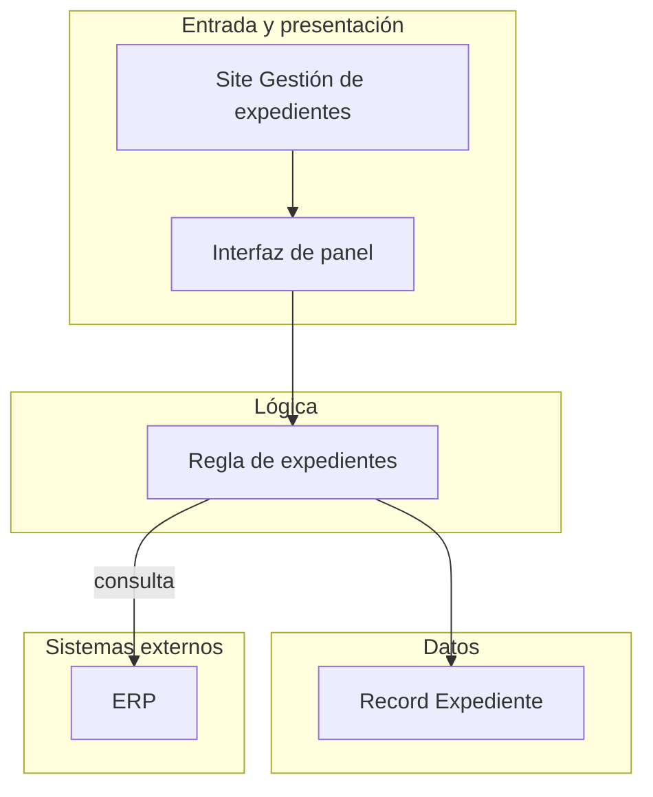
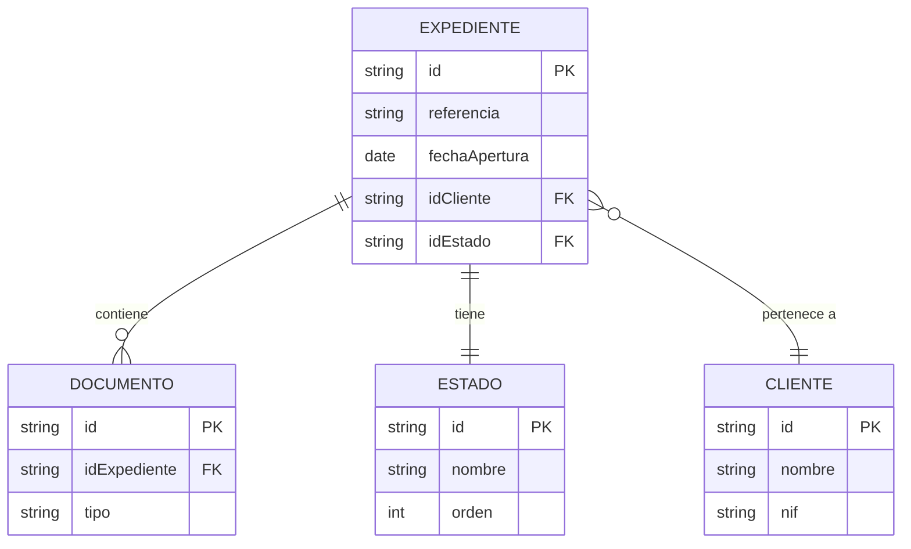
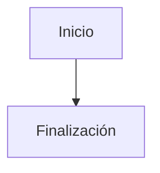
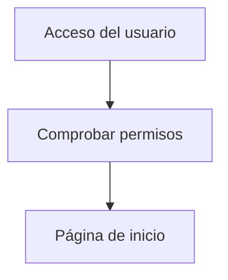
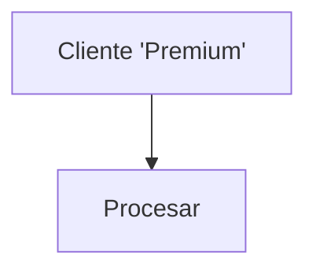
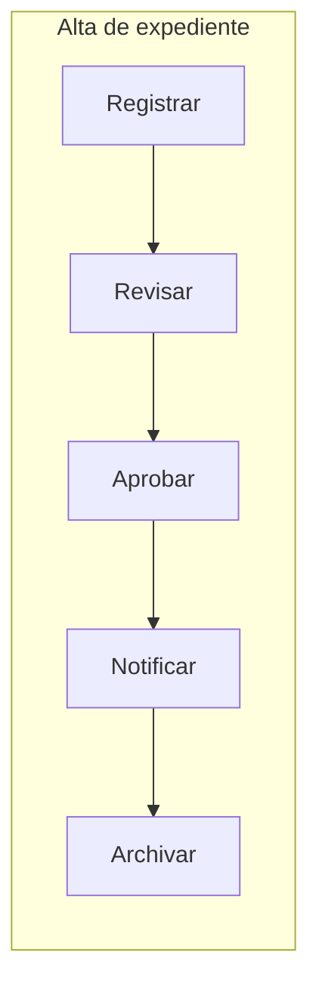

# Diagramas Mermaid

Qué diagramas Mermaid lleva la documentación y cómo se hacen para que se lean en una página. Los procesos no van en Mermaid: los dibuja en draw.io la skill de diagramas del plugin (`bpmn-mapping.md`). Esa misma skill valida y pinta los Mermaid con su `mermaid.py` (`<diagramas>` = `<skill>/../appian-diagramas-bpmn`).

## Qué se dibuja

Todos en `<salida>/diagrams/`, con nombres en minúsculas, sin acentos ni espacios. Cada `.mmd` tiene al lado su `.png` y su `.svg`, con el mismo nombre.

| Documento | Fichero | Qué muestra | Cómo |
|---|---|---|---|
| 01 | `flujo-general.mmd` | Actor → caso de uso → resultado | `flowchart TD`, ≤ 10 nodos; con muchos casos de uso, agrupados por actor |
| 02 | `arquitectura.mmd` (partido: `arquitectura-<capa>.mmd`) | Los objetos clave por capa y los sistemas externos | «Arquitectura por capas» |
| 03 | `modelo-datos.mmd`, `modelo-datos-<subdominio>.mmd`, `modelo-datos-subdominios.mmd` | Entidades y relaciones | «Modelo de datos» |
| 04 | `grupos.mmd` | Jerarquía de grupos, «Nombre (usuarios directos)» | `flowchart TD`, ≤ 30 nodos; con más, solo los grupos con subgrupos |
| 05, 06 | — | Sin diagrama propio: los sistemas externos están en el de 02 | — |
| 08, índice | `mapa-procesos.mmd` | Qué proceso lanza a cuál | «Mapa de procesos» |
| 10 | `navegacion.mmd` | Pantallas y los procesos a los que llevan sus acciones | `flowchart TD`, ≤ 30 nodos |
| 11 | `estados-<entidad>.mmd` | Ciclo de vida de una entidad, si lo tiene | `stateDiagram-v2` o `flowchart TD` |

## Cómo se pinta

- **Quien escribe un diagrama lo pinta** en cuanto lo escribe: `python3 <diagramas>/scripts/mermaid.py <salida>/diagrams/<nombre>.mmd --svg` deja `<nombre>.png` y `<nombre>.svg` junto al `.mmd`. Si da un error de sintaxis, se corrige. Si avisa de que pasa de 1.600 px de ancho, se rehace («Que quepa en una página»).
- **En el documento**, la imagen `.svg` y debajo «Fuente: [<nombre>.mmd]» (`presentation-rules.md`, Regla 2). El PDF usa el `.png`: las etiquetas del `.svg` son HTML y fuera de un navegador no se ven bien. El dashboard, el `.svg`.
- **Sin navegador**, `mermaid.py` sale con 2 y no hay imagen: el documento lleva el bloque ` ```mermaid ` idéntico al `.mmd`, y «Cobertura y límites» y `LEEME.md` lo dicen.
- **En la fase 5**, el orquestador vuelve a pintar todos los `.mmd` y pasa `mermaid.py --md` a cada documento que lleva bloques mermaid.
- Si un diagrama no sale bien después de tres intentos, va la tabla equivalente («Tabla en lugar del diagrama»).

## Que quepa en una página

Un diagrama de más de ~1.600 px de ancho no se lee en una página vertical. Las medidas son del Mermaid de la skill de diagramas (11.17.2), con etiquetas de unos 20 caracteres:

- `flowchart TD` por defecto; `LR` solo si es corto (unas 8 cajas en la fila más larga).
- Cada caja ocupa unos 260 px de ancho: en una fila caben 5. Etiquetas cortas (≤ 50 caracteres, mejor ≤ 25) y en las flechas solo si aportan.
- **Un `subgraph` cuyos nodos no tienen flechas con nodos de fuera se dibuja en la otra dirección**: en un `flowchart TD`, de izquierda a derecha. Una cadena de 8 cajas dentro de un único `subgraph` mide unos 2.300 px de ancho. Si todo el diagrama, o un grupo que no se une con el resto, va en un `subgraph`, pon `direction TB` dentro de él: la misma cadena mide 300 px. Si el `subgraph` tiene flechas con nodos de fuera, sigue la dirección del diagrama y `direction` no cambia nada.
- **No unas un `subgraph` con otro** (`C1 --> C2`): sus cajas se apilan en columna y el diagrama crece hacia abajo (seis capas: casi 2.900 px de alto). Une nodo con nodo.
- Si aun así no cabe, parte el diagrama (por capa, subdominio o tramo del flujo), un fichero por parte.

### Arquitectura por capas

- `flowchart TD`, un `subgraph` por capa, en el orden de `02` (las Web APIs arriba, con los sites, para que las flechas bajen), y al final un `subgraph` «Sistemas externos» con un nodo por sistema y una flecha desde la integración que lo llama.
- **Como mucho 5 cajas por capa**: cada capa es una fila (5 cajas, unos 1.350 px; 6, 1.600; 8, 2.100). Si una capa tiene más objetos clave, agrupa los del mismo papel en una caja («Interfaces de listado (12)») o parte el diagrama en `arquitectura-<capa>.mmd`.
- Las flechas, de nodo a nodo entre capas, y cada capa con alguna flecha hacia otra: una capa sin flechas se dibuja en columna.
- Solo los objetos clave (puntos de entrada, procesos raíz, hubs, records centrales e integraciones); el resto, en las tablas. Máximo 30 nodos.

### Modelo de datos

- `erDiagram`. Entidades en `PascalCase` o `SCREAMING_SNAKE_CASE`, sin espacios, guiones ni acentos; si el nombre real los lleva, el documento da la correspondencia «nombre en el diagrama ↔ nombre real».
- Relaciones: `||--||` uno a uno, `||--o{` uno a muchos, `}o--||` muchos a uno, `}o--o{` muchos a muchos, con la etiqueta entre comillas dobles (`EXPEDIENTE ||--o{ DOCUMENTO : "contiene"`).
- Atributos: los campos clave, como mucho 8 por entidad, `tipo nombre [PK|FK]`.
- Tamaño: hasta ~15 entidades, un diagrama; de ~15 a ~30, uno con las entidades clave más uno por subdominio; más de ~30, un mapa de subdominios (`flowchart TD`, un nodo por subdominio) y uno por subdominio de 8 a 15 entidades. El criterio es que se lea. Las tablas del documento cubren siempre todas las entidades.

### Mapa de procesos

- `flowchart TD`, un nodo por process model (con su forma de inicio en la etiqueta si cabe) y una flecha por arista `subProcess` o `startProcess` de `graph.json`.
- Con más de 30 procesos, solo los que se relacionan con otro; el resto queda en el catálogo del índice.
- Si ningún proceso lanza a otro, no hay mapa.

## Sintaxis que da menos errores

- **IDs** `N1`, `N2`… (en `erDiagram`, el nombre de la entidad). Sin guiones, espacios, acentos, puntos ni barras, y que no empiecen por `o` ni `x` minúsculas.
- **Etiquetas** entre comillas dobles, sin comillas dobles dentro (van simples), sin saltos de línea ni HTML (`<br>`, `<b>`). En las flechas, `-->|"Etiqueta"|`.
- **`end` en minúscula** no puede ser un ID ni una etiqueta sin comillas: «Fin» o «Finalización».
- Sin iconos `fa:fa-*` ni `classDef`.

## Tabla en lugar del diagrama

```markdown
> Diagrama representado como tabla por motivos de compatibilidad o tamaño.

| Origen | Tipo | Relación | Destino | Tipo | Etiqueta |
|---|---|---|---|---|---|
| Usuario | Actor | accede a | Site principal | Site | — |
| Site principal | Site | invoca | Process Model X | Process Model | Crear pedido |
```

## Ejemplos

### Arquitectura por capas



### Modelo de datos



### Errores frecuentes

Los ejemplos «Mal» van como texto, no como bloque mermaid: así `mermaid.py --md` no los da por errores de este documento.

Mal, `end` como ID:

```text
flowchart TD
  start[Inicio] --> end
```

Bien:



Mal, IDs con caracteres especiales y etiquetas sin comillas:

```text
flowchart TD
  user-login --> check.permissions --> home page
```

Bien:



Mal, HTML y comillas dobles en una etiqueta:

```text
flowchart TD
  A[Cliente<br>"Premium"] --> B[Procesar]
```

Bien:



Mal, una cadena entera dentro de un `subgraph` sin `direction` (se dibuja en horizontal):

```text
flowchart TD
  subgraph S["Alta de expediente"]
    N1["Registrar"] --> N2["Revisar"] --> N3["Aprobar"] --> N4["Notificar"] --> N5["Archivar"]
  end
```

Bien:


